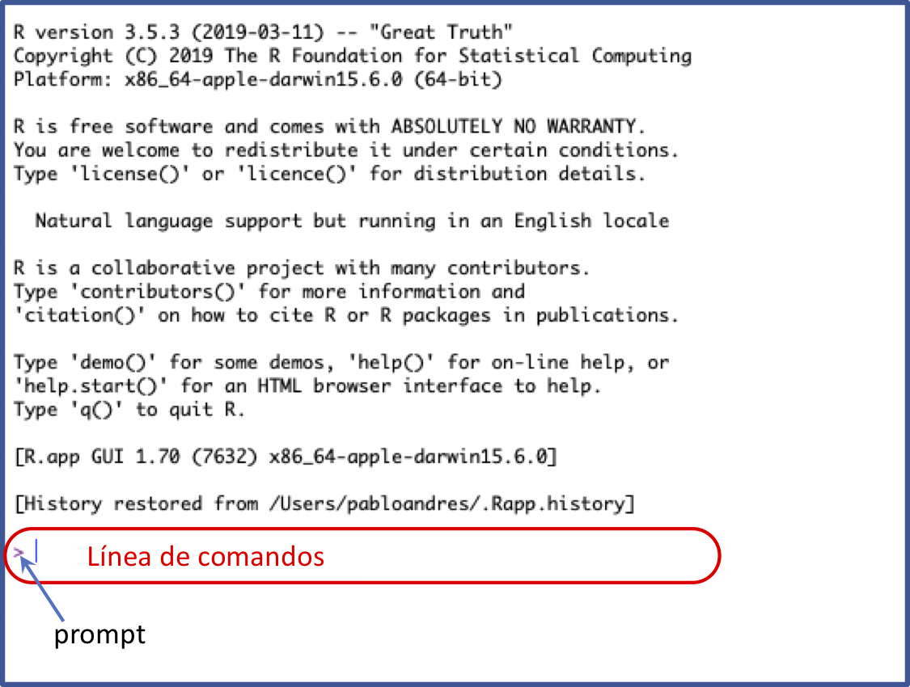
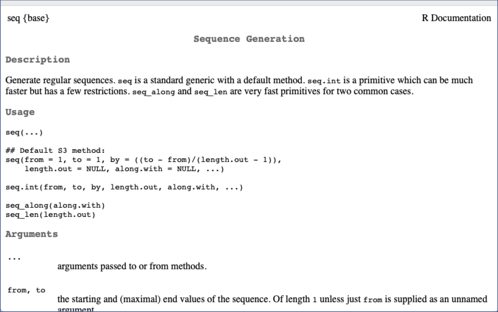
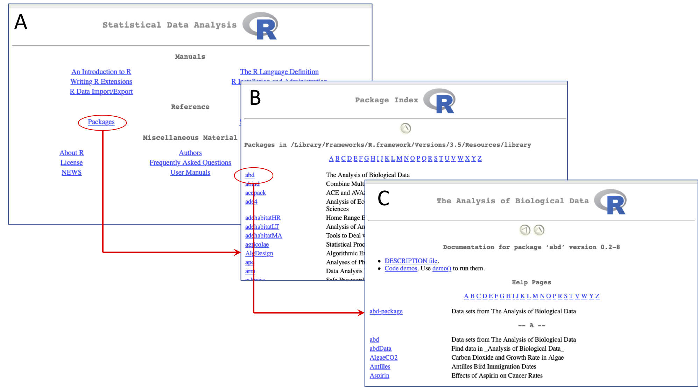

--- 
title: "_Programación_ para Biólogos"
author: "paguzmang | Programa de Biología - U.CES"
date: "Dic 2019"
site: bookdown::bookdown_site
output: 
  bookdown::gitbook:
    split_by: "section+number"
documentclass: book
bibliography: [packages.bib, ref.bib]
csl: apa.csl
biblio-style: apalike
link-citations: yes
github-repo: paguzmang/CursoProg
description: "Conceptos básicos de programación para biólogos con R"
---

```{r include=FALSE}
# automatically create a bib database for R packages
knitr::write_bib(c(
  .packages(), 'bookdown', 'knitr', 'rmarkdown'  
), 'packages.bib')
```

# Presentación {-}

Estas notas contienen  el material o contenido guía para apoyar un curso sobre **Programación** en nivel de pregrado para estudiantes de Biología. El curso esta diseñado para complementar, de forma computacional, conceptos adquiridos en los cursos previos de Matemáticas y ofrecer elementos adicionales sobre el uso de la programación en el quehacer del Biológo. Se usa como software principal **R**, ejecutado desde la IDE **Rstudio**.


<!--chapter:end:index.Rmd-->


```{r setup, include=FALSE}
library(knitr)
opts_chunk$set(fig.align = 'center', warning = F, message = F, comment = NULL, prompt=TRUE)
```

# (PART) Iniciando con R y Rstudio {-} 

# Generalidades {#general}

En esta sección se revisan aspectos básicos sobre el software **R** tales como conocer sus ventanas, identificar el prompt y trabajar en la línea de comandos,  crear, manejar y guardar scripts básicos, establecer el director de trabajo, conocer el manejo de un comando, paquetes y su instalación, etc. 

## Ventanas de R: Consola y script {#ventanasR}

Cuando abriemos **R** aparece una ventana llamada la **consola**. En esta ventana escribimos ordenes para **R** y se imprimen los resultados de tales ordenes. Enseguida se describen algunos aspectos relevantes del trabajo en la consola.

### Prompt y línea de comandos

El prompt (`>`) en la consola indica que el **R** esta listo para una nueva orden. El renglón cuyo inicio es marcado por el prompt se conoce como _línea de comandos_; en ella se escriben ordenes para **R**, y estas ordenes se ejecutan con un `enter` (Figura \@ref(fig:prompt)).

```{r prompt, echo = F, out.width='60%',  fig.cap='Consola del R mostrando el prompt (`>`) y la línea de comandos'}

```

Aquí un ejemplo del prompt con una orden para **R** en la línea de comandos:

```{r}
45 + 67/34   # calculo en la linea de comandos
```

El cuadro de bajo indica la impresión del resultado. El `[1]` que antecede el resultado indica la posición del resultado en la impresión. Así, el resultado `46.97059` esta en la posición nro. 1 de la impresión.  

Si al ejecutar una orden, la misma esta incompleta,  el **R** muestra un signo `+` en la siguiente línea indicando que falta algo de la orden anterior.

```{r, prompt = F, eval=F}
> 45 + 67/
+
```

Si se conoce la parte faltante para completar la orden se puede escribir luego del signo `+`:

```{r, eval=F, prompt=FALSE}
> 45 + 67/
+ 34
```

```{r, echo=FALSE}
45 + 67/34   # calculo en la linea de comandos
```

Si no se conoce lo que falta, se debe usar la tecla ESC para obligar al **R** a mostrar nuevamente el prompt, para después inciar la expresión desde el principio.

### Escribiendo en el script

El script es un archivo de texto plano (similar a word pero, no le pone formato al texto) donde se escriben las ordenes para **R** de forma más comada. Cuando se este seguro de las ordenes escritas se pueden enviar a la consola usando la combinación de teclas CTRL + R.

Es recomendable iniciar cualquier script con la fecha, un título corto sobre el contenido del script y el nombre del autor. Todo el texto que este a la derecha del signo `#` se deja como **comentario** y no se ejecuta.

```{r, eval=F, prompt = F}
# 17-jul-2019
# Ejemplo de un script
# Pablo A. Guzman

# Calculos
5 + 67/34    # calculo A
6 + 67/34    # calculo B
7 + 67/34    # calculo C
```


El archivo script se puede guardar con la extensión `.R` (recomendado) o con `.txt`.

## Comandos {#com}

Un comando es un objeto que realiza una tarea específica. Algunos ejemplos son:

- Comando `rep`:  repite un número o un conjunto de números cierta cantidad de veces. 
- Comando `seq`:  genera una secuencia de números. 
- Comando `sqrt`: saca la raíz cuadrada a un número.

### Sintaxis de un comando

Un comando en **R** tiene la siguiente forma:

```{r, eval = F, prompt = F}
nombre(arg1 = valor1, arg2 = valor2, arg3 = valor3)
```

donde la palabra `nombre` es el nombre del comando y dentro de los paretensis se encuentran los argumentos (`arg1`, `arg2`, etc.) del comando. Algunos ejemplos usando los comandos descritos arriba:

```{r}
rep(x = 4, times = 5)  # se repite el 4 cinco veces
seq(from = 4, to = 12, by = 2)  # secuencia desde 4 hasta 12 cada 2
sqrt(9)  # raiz cuadrada de 9
```

### Ayuda sobre comandos

Si sabemos el nombre de un comando podemos ir directamente a la archivo de ayuda del comando usando la sintaxis: `?nombre`, donde `nombre` es el nombre del comando. P.e.,

```{r}
?seq   # se solicita la ayuda del comando seq
```


```{r ayudaSeq, echo = F, out.width='60%',  fig.cap='Ayuda del comando `seq`'}

```

La figura \@ref(fig:ayudaSeq) muestra la ayuda del comando `seq`. Otra forma de solicitar ayuda es con el comando `help`:

```{r}
help(rep)   # solicitando ayuda sobre el comando 'rep'
```

Si no sabemos el nombre del comando, si no que queremos buscar en todo la ayuda, donde aparece cierta palabra usamos doble signo de interrogación de la siguiente forma:

```{r}
??average   # se busca entradas relacionadas con la palabra 'average'
```

### Orden de los argumentos

Los argumentos de un comando tienen un orden específico. Si se respeta el orden, se puede omitir el nombre del argumento y escribirse sólo su valor. P.e., el orden de los argumentos del comando `seq` son `from`, `to` y `by`. Si respetamos este orden podemos usar el comando de la siguiente forma:

```{r}
seq(4, 12, 2)  # uso de un comando sin nombres de argumentos
```

El orden se puede mantener parcialmente y en ese caso se pueden usar nombres para algunos argumentos y para otros no:

```{r}
seq(4, by = 2, to = 12)  # usando algunos argumentos con nombre y otros sin nombre
```

Podemos consultar los argumentos y su orden en la ayuda (sección: `arguments`) del comando:


```{r}
?seq  # abriendo la ayuda para ver los argumentos
```


## Paquetes o librerías {#paquetes}

Un **paquete** (o librería) es un conjunto de comandos. Es decir los comandos se agrupan en paquetes. Cuando instalamos **R**, este ya viene con varios paquetes instalados tales como: `base`, `utils`, `stats`, `Matrix`, `Lattice`, etc. P.e., los comandos `seq`, `rep` y `sqrt` revisados atras son del paquete `base`. Sin embargo, en el CRAN (repositorios de **R**) existen más de 14000 paquetes disponibles.

Algunas necesidades relevantes con paquetes son las siguientes:

- Identificar el paquete al cual pertenece cierto comando. Esto se puede hacer consultando la ayuda del comando. En la esquina superior izquierda aparece el nombre del paquete entre llaves, vease la figura \@ref(fig:ayudaSeq).

- Identificar todos los comandos pertenecientes a cierto paquete: Consulte la ayuda del paquete. Para esto, siga la ruta: Menu Ayuda -> Ayuda HTML -> Paquetes -> Seleccione el paquete -> Lista de comandos. La Figura \@ref(fig:ayudaPaq) muestra esta ruta hasta seleccionar la lista de comandos del paquete `abd` [@middleton2015], este es un paquete con bases de datos del libro de @whitlock2015.

    ```{r ayudaPaq, echo = F, out.width='99%',  fig.cap='A. Página principal de la ayuda HTML. Se marca la opción _Packages_. B. Inicio de la página de la lista de paquetes luego de acceder por la opción _Packages_. Se selecciona el paquete `abd`. C. Lista de comandos del paquete `abd`. Este paquete no viene instalado con el **R**. Para instalación de paquetes vaya a [aquí](#instalPaq)'}

```


- Conocer cuales paquetes tenemos instalados. Siga la ruta Menu Paquetes -> Cargar paquete, esto le abre un cuadro de dialogo con los paquetes instalados. También, la siguiente expresión para **R** abre una ventana con un listado de los paquetes instalados:

    ```{r, results='hide'}
library()  # abre ventana con listado de paquetes instalados
```

- Visitar el [CRAN](https://cran.r-project.org/web/packages/) (repositorios del **R**) para buscar paquetes: En el enlace <https://cran.r-project.org/web/packages/>. En esta página puede escoger consultar los paquetes en orden alfabetico o por fecha de publicación. P.e., seleccione por orden alfabetico. Cuando este en la página del listado de paquetes se recomienda usar el buscador de su explorador (se activa con las teclas CTRL + F) para buscar temas por alguna palabra clave. P.e., busque la palabra clave "genet" o "ecology" para ver que paquetes se relacionan con estos temas.


### Instalando paquetes {#instalPaq}

Para instalar un paquete se recomienda hacerlo desde **R** usando el comando `install.packages`. Suponga que se desea instalar el paquete `ape` [@paradis2018] el cual no viene instalado con el **R** y esta enfocado al análisis filogenético. Puede verificar que `ape` aparece en el [CRAN](https://cran.r-project.org/web/packages/). Para instalarlo, se escribe:

```{r,  eval = F}
install.packages('ape')  # Descarga e instalacion de paquete 'ape' y sus dependencias
```

La expresión anterior instala tanto el paquete de interés como los paquetes de los cuales depende. Usted puede consultar si el paquete en efecto se instaló usando alguno de los métodos revisados atras. También puede preguntar de forma específica si el paquete esta instalado usando la siguiente expresión:

```{r, prompt=T, eval = F}
# Se consulta si el paquete 'ape' esta instalado:
is.element(el = 'ape',  set = installed.packages()[, "Package"])
```

```{r, prompt=T, echo = F}
T
```


El resultado `TRUE` indica que el paquete `ape` si esta instalado.

### Activando paquetes

La orden anterior descarga e instala un paquete, pero no lo activa. Cuando un paquete se instala, permanece "apagado" o "escondido" y sus comandos no estarán disponibles hasta que se active o se prenda el paquete en una sesión específica. Para activar un paquete se usa el comando `library`:

```{r, eval = F, prompt=TRUE}
library(ape)  # se activa el paquete 'ape' luego de haberlo instalado
```

La instalación de un paquete sólo es necesario hacerla una vez, pero la activación del paquete se debe hacer cada vez que volvamos a abrir el **R** (y se requiera el paquete). El comando `search`, sin argumentos, imprime en la consola sólo los paquetes activados en una sesión.

## Creando o guardando objetos {#guardarObj}

El **R** es un lenguaje orientado a objetos. Esto quiere decir que todo en **R** es un objeto que se puede manipular (crear, modificar, borrar) y que ocupa un espacio físico en la memoria de nuestro computador. Piense en un objeto como un **contenedor de información**.

Así,  comandos tales como `seq` o `rep` son objetos que ya vienen instalados con **R** y que contienen información sobre como realizar tareas específicas. Otros tipos de objetos nos permiten almacenar información (datos) bajo diferentes estructuras de organización.

Si vienen el **R** ya pone a nuestra disposición muchos objetos, el usuario puede crear sus propios objetos. Para **crear** un nuevo objeto con "algo" dentro, usamos una flecha (`<-`) creada por la combinación de teclas menor que (`<`) y el guión medio (`-`). **Crear** un objeto es lo mismo que **guardar** información en un objeto. Aquí algunos ejemplos:

```{r, prompt=T}
x <- 45   # se guarda el 45 en x o se crea x con el nro. 45
w <- seq(4, 12, 2)  # se guarda el resultado del comando seq
z <- x^2    # se guarda el resultado de elevear al cuadrado el objeto 'x'
```

Notese que cuando se guarda o se crea un objeto, no se imprime por defecto en la consola el contenido del objeto. Para ver ese contenido, se debe ejecutar el nombre del objeto creado:

```{r, prompt=T}
x  # se ejecuta el objeto para imprimir su contenido
w  # se ejecuta el objeto para imprimir su contenido
```

La flecha (`<-`) indica que se esta **asignando** la información al objeto donde apunta la flecha. De esta forma, la flecha funciona en ambos sentidos. Así, las siguientes dos expresiones son equivalentes:

```{r, prompt=T}
w <- seq(4, 12, 2)
seq(4, 12, 2) -> w
```

### Recomendaciones para darle nombre a objetos

- El nombre debe ser una sola palabra (no debe tener espacios) sin caracteres especiales (p.e., tildes, "/", ":", "<", "( )")

- Evite usar la ñ en el nombre de un objeto. También evite usar el nombre de un comando ya existente en **R**.

- El nombre **debe ser corto** pero diciente del contenido del objeto. Algo que nos ayude a recordar que tiene el objeto. P.e., si vamos a registrar la edad de una persona y usamos `x` como nombre del objeto, en unos días olvidaremos que tiene ese objeto. Pero si usamos la palabra `edad` como nombre, recordaremos más fácil su contenido.

- Evite usar mayusculas. P.e., un nombre tal como `Edad` será mas propenso a generar errores de escritura que un nombre como `edad`.

- Si quiere usar una combinación de dos palabras para nombrar un objeto, utilice alguna de las siguientes estrategias:

    + Mínuscula y mayuscula. P.e., edadMujeres
    + Separadas por un guión bajo. P.e., edad_mujeres
    + Separadas por un punto. P.e., edad.mujeres


- Utilice un nombre clave como `temp` (de temporal) para nombrer objetos que no tienen mucha importancia en su sesión y que muy posiblemente los va a borrar después.

## Ambiente de trabajo {#ambiente}

El ambiente de trabajo (**environment** ó **workspace**) esta conformado por los objetos que el usuario crea o guarda en una sesión. P.e., en la sección anterior creamos tres objetos `x`, `w` y `z` de modo que estos tres objetos conforman nuestro ambiente de trabajo actual.

### Listar y borrar objetos del ambiente de trabajo {#borrarAmb}

Para imprimir el nombre de los objetos que conforman el ambiente de trabajo usamos el comando `ls` sin argumentos:

```{r, prompt=T}
ls()   # imprimiendo los objetos del ambiente de trabajo
```

Para borrar objetos específicos del ambiente de trabajo, usamos el comado `rm`:

```{r, prompt=T}
rm(x)   # se remueve el objeto 'x' del ambiente de trabajo
```

Volvemos a preguntar por los objetos:

```{r, prompt=T}
ls()   # imprimiendo los objetos del ambiente de trabajo
```

y notamos que ya no aparece el objeto `x`. Para borrar todos los objetos de una sola vez usamos la siguiente la expresión: 

```{r, prompt=T}
rm(list = ls())   # borrando todos los objetos del ambiente de trabajo de una sola vez
```

Observe que ya no existe ningún objeto:

```{r, prompt=T}
ls()   # imprimiendo los objetos del ambiente de trabajo
```

El resultado `character(0)` representa que le resultado esta vacio, indicando que no existe ningún objeto en el ambiente de trabajo.

### Guardando el ambiente de trabajo

Para guardar en nuestro computador todo el ambiente de trabajo (es decir, todos los objetos que hemos creado) usamos el comando `save.image`. Enseguida creamos tres objetos (puesto que al final de la sección [anterior](#borrarAmb) borramos todo) y luego usamos `save.image` para guardarlos: 

```{r, prompt=T}
x <- 45   # se guarda el 45 en x o se crea x con el nro. 45
w <- seq(4, 12, 2)  # se guarda el resultado del comando seq
z <- x^2    # se guarda el resultado de elevear al cuadrado el objeto 'x'
save.image('mis_objetos.RData')  # se guarda el workspace (todos los objetos creados en la sesion)
save(x, w, file = 'xw.RData')    # se guardan solo los objetos x, w
```

El comando `save.image` guarda o crea un archivo llamado `mis_objetos.RData`. Este comando guarda **todos** los objetos del ambiente de trabajo, mientras que el comando `save` guarda objetos específicos. En este caso, con el comando `save` se guardan sólo `x` y `w` en un archivo llamado `xw.RData`. 

En ambos casos, los archivos generados quedan alojados en una carpeta de nuestro computador conocida como el _directorio de trabajo_ (**working directory**). Cuando abrimos **R**, si no hacemos otra cosa, él mismo determina un _directorio de trabajo_. Para conocer el _directorio de trabajo_ actual se usa el comando `getwd`:

```{r, prompt=T, results='hide'}
getwd()   # Muestra cual es el directorio de trabajo actual
```

```{r, echo=F, prompt=T }
dir1 <- "/Users/pabloandres/Documents"
save.image(paste0(dir1,  '/mis_objetos.RData'))
save(x, w, file = paste0(dir1,  '/xw.RData'))
dir1
```

Usted puede examinar el contenido de su directorio de trabajo usando el comando `dir` (ó el comando `list.files`):

```{r, echo=T, prompt=T, results='hide'}
dir()  # se examina el contenido del directorio de trabajo
```

```{r, echo=F }
dir(dir1)
```

Note que existen `r length(dir(dir1))` archivos en el directorio de trabajo y dos de ellos son `mis_objetos.RData` y `xw.RData`, los cuales fueron guardados atras usando los comandos `save.image` y `save` respectivamente.

### Cambiando el directorio de trabajo

El _directorio de trabajo_ (**working directory**) es una carpeta en el computador donde **R** guarda o lee archivos por defecto. Es muy importante conocer cuál es este directorio para poder gestionar los archivos asociados a nuestra sesión de trabajo con **R**. 

Al comienzo de toda sesión es recomendable establecer nuestro propio _directorio de trabajo_. Para hacer esto aplique los siguientes los pasos:

```{r, include = F}
dir2 <- paste0(dir1, '/prog')
if(!dir.exists(dir2)) dir.create(dir2) # se crea una carpeta 'prog'
```

1. Cree una carpeta en alguna ubicación de su computador. P.e., enseguida crearé una carpeta llamada `prog` en la ruta ``r dir1`` de mi computador. Usted debe buscar su propia ubicación para crear la carpeta `prog`.

2. En **R** use el comando `setwd` para establecer el directorio de trabajo a la carpeta creada en el paso (1):

    ```{r, eval=F}
setwd("/Users/pabloandres/Documents/prog")
```

    Lo anterior también se puede hacer de forma interactiva desde la consola de **R**, usando la opción `Cambiar dir ...` del Menu _File_ en Windows o del Menu _Misc_ en Mac.
    
3. Verifique con `getwd` que el _directorio de trabajo_ si halla cambiado:

    ```{r,  eval=F}
getwd()
```

    ```{r,  echo = F}
dir2
```

4. Ahora, cuando guarde un archivo desde **R**, este quedará en el nuevo _directorio de trabajo_. P.e., puede volver a usar `save.image` para guardar el ambiente de trabajo:

    ```{r,  eval = F}
save.image('mis_objetos.RData')
```

```{r,  include = F}
save.image(paste0(dir2, '/mis_objetos.RData'))
```

    y verificamos el contenido del nuevo directorio de trabajo con `dir`:
    
    ```{r,  eval = F}
dir()
```

    ```{r,  echo = F}
dir(dir2)
```

Note que ahora, el archivo `mis_objetos.RData` quedó guardado en el nuevo _directorio de trabajo_.

```{r, include = F}
# remocion de archivos y carpetas
file.remove(paste0(dir1, '/mis_objetos.RData'))
file.remove(paste0(dir2, '/mis_objetos.RData'))
file.remove(paste0(dir1, '/xw.RData'))
file.remove(dir2)
```

### Cargando objetos al ambiente de trabajo

Si tenemos un archivo `.RData` con algunos objetos y queremos cargar este archivo a nuestro ambiente de trabajo actual, podemos usar alguna de las siguientes opciones:

- Usar el comando `load`. P.e., la orden `load('mis_objetos.RData')` carga los objetos del archivo `mis_objetos.RData`. El archivo debe estar en el directorio de trabajo.

- Usar la opción `Cargar área de trabajo` del menu `Archivo` de la consola en Windows o la opción `Load Workspace File ...` del menu `Workspace` en la consola de Mac.

> Atención: Si va a cargar un `.RData` que tiene objetos con el mismo nombre de objetos que ya tiene en su ambiente de trabajo, estos objetos serán reemplazados por los nuevos. Por tanto, tenga cuidado cuando realiza esta acción.

## Ejercicios {#ejercicios}

1. Escriba el código **R** requerido para calcular $y$ en las siguientes funciones matemáticas:

    a. $y = |4x - 1| - 2$; para $x = -3$
    
    b. $y = \frac{1}{3}\sqrt{7 - x}$; para $x = -2$
    
    c. $y = \dfrac{\sqrt{x+1}}{x^ 2}$; para $x = \sqrt{2}$
    
    d. $y = \dfrac{e^x + e^{-x}}{2}$; para $x = 1$ y para $x = -1$
    
    e. $y = ae^{-be^{-cx}}$; para $x = 4, a = 5, b = 1, c = 1$
    
    f. $y = \log_{3} x$; para $x = 9$
    
    g. $y = \log_{10} x$; para $x = 0.0001$
    
    Ayuda: `?log10`; `?abs` ; `?Arithmetic`; `?sqrt`
    
 
 2. Escriba el código **R** que le permita verificar que el valor de $x$ dado es una solución de las siguientes (in)ecuaciones.
 
    a. $\log_{3} (7-x) - \log_{3} (1-x) = 1$.  Solución: $x = -2$
    
    b. $\dfrac{x(1-x)}{x + 2} \geq 0$. Una posible solución: $x = 0.5$
    


3. Explique y diferencie los siguientes conceptos: **comando**, **argumento**, **paquete** y **librería**.

4. Explique y diferencie los siguientes conceptos: **objeto**, **ambiente de trabajo**, **directorio de trabajo**.

5. Considere la ecuación $y = x^2  e^{-x/2}$, donde $e = `r round(exp(1),4)`$ es la base de los logaritmos naturales. Cree un script para **R** que calcule $y$ para $x = 2$, $x = 4$ y $x = 6$. Guarde cada resultado en un objeto, p.e., `y2`, `y4` y `y6`. Guarde los tres objetos en un archivo .RData. Decida usted el nombre del archivo. Ayuda: En **R** el comando `exp` saca la exponencial a un número. Por ejemplo, $e^1 =$ `exp(1)`, $e^2 =$ `exp(2)`. Envie el archivo .RData al correo pguzman@ces.edu.co.

6. Sin hacerle ningún cambio, ejecute el siguiente script de código **R**, identifique los errores y corrijalos. Vuelva a ejecutar el script y verifique su corrección. 

    ```{r, eval = F, prompt = F}
pa <- 45/9  # se crea el objeto pa
pb - 3      # se crea el objeto pb

# se hace un grafico con un punto en la coordenada (pa, pb)
plot(x = pa, y = pb, pch = 15 cex = 20, col = 'red')  
```
    
    Al corregir el código y ejecutarlo se debe producir el siguiente gráfico:
    
```{r, echo = F, fig.width=3, fig.height=3}
pa <- 45/9  # se crea el objeto pa
pb <- 3      # se crea el objeto pb

# se hace un grafico con un punto en la coordenada (pa, pb)
par(mar = c(3,3,1,1), mgp = c(2,1,0), cex = 0.9)
plot(x = pa, y = pb, pch = 15 , cex = 20, col = 'red')  
```
    
7. En cada caso muestre el código requerido para crear los siguientes patrones de números o texto:

    a. `r seq(10, 50, by = 10)`
    b. `r seq(-10, 50, by = 10)`
    c. `r -3:5`
    d. `r rep(45, 10)`
    c. `r rep('thanos', 5)`
    
8. Para cada comando, (a) describa para que sirve, (b) liste sus tres primeros argumentos, y (c) diga a que paquete pertence.

    - `runif`
    - `substr`
    - `install.packages`
    - `dir`
    
9. Considere el siguiente script con código **R**:

    ```{r, eval = F, prompt = F}
library(graph)
nodos <- c('A', 'B', 'C', 'D')
bordes <- list(
  A = list(edges = c('B', 'C') ),
  B = list(edges = 'D'),
  C = list(),
  D = list()
)
g1 <- new('graphNEL', nodes = nodos, edgeL = bordes, 
          edgemode = 'directed')
g1
```
    
    Para el código dado (sin ejecutarlo), responder lo siguiente:
    - ¿Cuáles comandos se utilizan?
    - ¿Cuáles objetos fueron creados?
    - ¿Cuáles librerías fueron activadas?
    - Si se ejecutará todo en la consola, ¿de cuál objeto se imprimiría su contenido?
    - Ejecute en la consola la primera línea (`library(graph)`), si le sale un error, explique porque salio ese error. 
    
10. Verifique si tiene instalado el paquete `dismo`. Si no, descarguelo,  instalelo y activelo en su sesión de **R**. Luego responda las siguientes preguntas:

    a. ¿Para qué sirve el paquete `dismo`?.
    b. Busque el comando `gbif` e indique para sirve el comando.
    b. Ejecute la siguiente orden: `gbif('solanum', 'acaule', download=FALSE)`. Usando la ayuda del comando, intente explicar el resultado. (Nota: debe tener conexión a internet).

10. Considere la siguiente secuencia de ordenes de  **R** que fueron ejecutadas en la consola con su respectiva impresión:

```{r, include = F}
dir1 <- "/Users/pabloandres/Documents"
dir2 <- paste0(dir1, '/Notas')
if(!dir.exists(dir2)) dir.create(dir2) # se crea una carpeta 'Notas'
```


    ```{r, prompt = T,  eval= F}
getwd()  # A
```

    ```{r, echo = F}
dir1
```

    ```{r, prompt = T, eval= F}
dir()   # B
```

    ```{r, echo = F}
dir(dir1)
```

    ```{r, prompt = T, eval= F}
setwd("/Users/pabloandres/Documents/Notas")  # C
```

    ```{r, prompt = T, eval= F}
getwd()
```

    ```{r, echo = F}
dir2
```

    ```{r, prompt = T, eval= F}
nota1 <- 2.1
nota2 <- 3.1
nota3 <- 2.9
nota.final <- nota1*0.2 + nota2*0.5 + nota3*0.3
save(nota.final, file = 'minota.RData')   # D
```

    a. Explique con detalle que acción fue realizada en cada una de las líneas marcadas con los comentarios A, B, C y D.
    b. En que carpeta quedó guardado el archivo `mininota.RData`
    
    ```{r, eval = F, include = F, echo = F}
library(learnr)
question("What number is the letter A in the alphabet?",
  answer("8"),
  answer("14"),
  answer("1", correct = TRUE),
  answer("23")
)
```

    
    c. Describa el contenido del archivo `mininota.RData`
    
```{r, include = F}
# remocion de archivos y carpetas
file.remove(dir2)
```


11. El siguiente script de código **R** requiere el archivo `pesticidas.RData`. 

```{r farmPest, include=F}
# Farm pesticide use in the United States 1964-1990 (million pounds of active ingredients)
# Source: Braude & Low, 2010, An Introduction to Methods & Models in Ecology, Evolution & Conservation Biology. chapter 1, table 1.1
farmPest <- data.frame(
  year = c(1964, 1966, 1971, 1976, 1982, 1986, 1987, 1988, 1989, 1990),
  herb = c(76, 112, 207, 374, 451, 410, 365, 372, 394, 393),
  insect = c(143, 138, 127, 130, 71, 59, 57, 60, 61, 64),
  other = c(72, 79, 130, 146, 30, 6, 7, 8, 8, 8)
)
save(farmPest, file = 'pesticidas.RData')
```


    ```{r, prompt = F, fig.show = 'hide'}
# 12-may-2018
# Grafico sobre el uso de herbicidas en Estados Unidos entre 1964 y 1990
# en millones de libras de ingrediente activo.
# Autor: Pedro Perez.

# Datos:
load('pesticidas.RData')  # coloque aqui lo que hace esta orden
    
# Se hace el grafico
par(mar = c(3.5, 4, 2.5, 1), mgp = c(2,1,0), cex = 0.9)
with(farmPest, 
  plot(x = year, y = herb, xlab = 'Tiempo (Años)', 
       ylab = 'Herbicidas\n(millones de libras de ingrediente activo)',
       pch = 21, bg = 'skyblue', type = 'b', cex = 1.5,
       main = 'Uso de herbicidas en granja en Estados Unidos')
)
```


    a. Descargue el archivo `pesticidas.RData` desde [aquí](https://github.com/paguzmang/TalleresCursos/blob/master/CursoProg_uces/cap1/pesticidas.RData). Cree y establezca un directorio de trabajo. Dentro de esta carpeta, ubique el archivo `pesticidas.RData`. También cree un nuevo script que contenga el código dado arriba. Verifique que su espacio de trabajo este vacio.
    
    b. Ejecute el código y observe el resultado. ¿Cuáles objetos se crearon? Explore y describa el contenido de estos objetos.
    c. ¿Qué hace la línea `load(pesticidas.RData)?` Escribalo en el código.
    d. ¿Cuáles comandos se utilizan en el código?
    e. Mencione el nombre de los argumentos usados en `par`.
    f. ¿Cuántos argumentos se usaron en `with`, se usó el nombre de sus argumentos o sólo su valor?
    g. Mencione el nombre de los argumentos usados en `plot`. 
    h. Cambie el color del relleno de los puntos del gráfico con el argumento `bg` del comando `plot`. Seleccione un color de alguno de los `r length(colors())` colores que salen cuando se imprime la orden `colors()` en la consola. Guarde el nuevo gráfico con extensión `.jpg` en su directorio de trabajo.
    i. Al final del código, agregue la siguiente línea para modificar el objeto cargado en el paso (b):
  
    ```{r}
farmPest$total <- rowSums(farmPest[, 2:4])  
```

     Explore nuevamente el objeto y describa como cambio el objeto. 
    
    j. Agregue una línea al código que guarde un archivo llamado `pesticidas.RData` con todos los objetos usados durante la sesión. Note que como este archivo tiene el mismo nombre que el inicial, será reemplazado.
    k. A este momento debe tener tres archivos en su directorio de trabajo. ¿Cuáles? **Comprima** la carpeta con estos tres archivos y envíela por correo al pguzman@ces.edu.co.


<!--chapter:end:01-general.Rmd-->


# Ambientes de desarrollo integrado {#ides}

Un ambiente de desarrollo integrado (IDE, de sus siglas en ingles: Integrated developmetn enviroment) es una interfaz gráfica que se integra con R para facilitar la gestión de una sesión de trabajo con R. <https://www.slant.co/topics/2897/~best-r-ides> Aquí nos centraremos en Rstudio.

## RStudio 1 {#rstudio1}

Cuando abriemos **R** aparece una ventana llamada la **consola**. En esta ventana escribimos ordenes para **R** y se imprimen los resultados de tales ordenes. Enseguida se describen algunos aspectos relevantes del trabajo en la consola.

## Rstudio 2 {#rstudio2}

El prompt (`>`) en la consola indica que el **R** esta listo para una nueva orden. El renglón cuyo inicio es marcado por el prompt se conoce como _línea de comandos_; en ella se escriben ordenes para **R**, y estas ordenes se ejecutan con un `enter` (Figura \@ref(fig:prompt)).


<!--chapter:end:02-rstudio.Rmd-->

# (PART) Objetos, datos y gráficos {-} 

# Vectores y tipos de datos {#vecTiposDatos}

En este archivo introducimos el **vector**, el _objeto_ más básico que tiene **R** y revisaremos los tipos de datos que podemos almacenar o guardar en un vector así como también un conjunto de expresiones lógicas que nos permitirán manipular vectores.

## Vectores {#vectores}

El **R** tiene diferentes tipos de objetos que permiten almacenar información. El **vector** es el objeto más sencillo. Otros tipos son las matrices, los data.frame o las listas.

### Creando vectores

Un **vector** se crea con el comando `c`, primera letra del verbo `c`oncatenar. El comando `c` _concatena_ (o junta) datos en un vector. Aquí un par de ejemplos:


```{r}
# Creacion de dos vectores 
x <- c(2, 4, 8)                     # vector con tres numeros
x                                   # se imprime el contenido
y <- c('pedro', 'judas', 'pablo')   # vector con tres palabras
y                                   # se imprime el contenido
```

Crear un vector usando `c` tiene sentido cuando se deben juntar mínimo dos datos. Cuando es sólo uno, no se requiere el comando `c`.

```{r}
w <- 16  # se crea un vector de un solo elemento
w        # se imprime 
```

Puede validar si un objeto es un vector usando el comando `is.vector`:

```{r}
is.vector(x)   # ¿x es un vector?
is.vector(w)   # ¿w es un vector?
```

Puede usar `c` para juntar datos individuales con otro vector

```{r}
z <- c(x, w, 32)   # se juntan x, w y el 32 en otro vector
z                  # mire el resultados
```


El siguiente código crea dos vectores, `f1` y `f2`. Adicione una línea de código que genere un vector llamado `ft` que contenga los elementos de `f1` y de `f2`, finalice con una cuarta línea que imprima el vector `ft`
 
```{r suma, exercise = T}
f1 <- c(34, 44, 54)
f2 <- c(2, 4, 6)

```


### Creando vectores de secuencias

Considere las siguientes expresiones, comandos y objetos que nos permiten crear **vectores** con cierta secuencia de números o texto:

```{r}
1:10         # la expresion : crea una secuencia de uno en uno.
-5:5         
seq(from = 2, to = 10, by = 2)  # crea una secuencia con cierto tamano de paso
letters      # vector que contiene todas las letras del abecedario en minuscula
LETTERS      # vector que contiene todas las letras del abecedario en mayuscula
rep(x = 1:3, each  = 4)   # el comando rep crea vectores con patrones de repeticion especificos
rep(x = 1:3, times = 4)   # el comando rep crea vectores con patrones de repeticion especificos
rep(x = c('a', 'b', 'c'), each = 3)
```


### Operaciones aritméticas con vectores

Cuando uno o más vectores se involucran en operaciones aritméticas ($+$, $\times$, $\div$), estas se hacen **elemento por elemento**. Considere los siguientes ejemplos y su resultado:

```{r}
x <- c(2,4,8,16,32)  # se crea un vector
y <- 1:5             # se crea otro vector
x + 1                # se suma 1 a cada elemento de x
log2(x)              # se saca log en base 2 a cada numero de x
x^2                  # se eleva al cuadrado cada numero de x
x + y                # se suma cada elemento de x a cada elemento de y
(x + y)/2            # se suman los elementos de 'x' con 'y', luego el resultado se divide por 2
```


## Tipos de datos {#tiposDatos}

En un vector podemos almacenar principalmente los siguientes tipos de datos:

+ numeric = números con decimales (separador decimal: punto). También se llaman de _punto flotante_ o de tipo _double_.
+ integer = números enteros.
+ character = texto (se escribe entre comillas, sencillas o dobles).
+ logical  = TRUE (o T), FALSE (o F). Resultado de expresiones lógicas.
+ Date = fecha (aaaa-mm-dd).
+ Inf = Infinito. También existe `-Inf`
+ NA  = dato perdido o faltante
+ NaN = no se puede calcular, "No un número"
+ NULL = No existe o no hay nada.


```{r}
# Ejemplo de escritura datos de diferente tipo
a <- c(5.89, 10, 23.4)        # numero con decimales (double)
b <- c(5L, 6L, 7L)            # numero entero (integer)
x <- 'semillero'              # texto
y <- c(TRUE, FALSE, F, F)     # valor logico
f1 <- as.Date('2018-08-01')   # fecha: aaaa-mm-dd
f2 <- as.Date('2018-08-30')   # fecha: aaaa-mm-dd
d <- c(NA, 7, 4, NA)          # vector con datos perdidos (not available)
w <- 0/0                      # No se puede calcular (NaN = Not a Number)
z <- 10/0                     # Infinito (Inf)
h <- sqrt(-2)                 # No se puede calcular (NaN = Not a Number)
```


### Validando el tipo de datos

El comando `typeof` permite preguntar por el tipo de dato contenido en el objeto:

```{r}
typeof(a)
typeof(b)
typeof(x)
typeof(y)
typeof(f1)
typeof(d)
typeof(w)
typeof(z)           
```

Los comandos `is.numeric`, `is.logical`, `is.character`, `is.na`, `is.nan`, etc. permiten preguntar si un objeto es de cierto tipo o no:


```{r}
# ¿es numeric?, ¿es logical?, ¿es character?, ¿es NA?
is.numeric(a)
is.logical(y)
is.character(x)
is.na(d)
```


## Expresiones lógicas {#logicas}

Una expresión lógica hace una pregunta sobre si uno o más objetos cumplen una condición y devuelve verdadero (TRUE) o false (FALSE). Las principales formas de crear expresiones lógicas son:

```{r}
a > 10               # mayor que ...
a >= 10              # mayor o igual que ...
a < 10               # menor que ...
a <= 10              # menor o igual que ...
x == 'semillero'     # igual a ...
x != 'semillero'     # diferente de ...
a > 2 & a < 10       # ... y ... (2 < a < 10)
a < 2 | a > 10       # ... o ... (a < 2 o a > 10)
! (a < 2)            # negacion (! = convierte el T en F y viceversa)
is.na(a)             # ¿a esta perdido?
! is.na(a)           # ¿a no esta perdido?
is.nan(h)            # ¿h tienen elementos NaN?
```

## Ejercicios {#ejvecTiposDatos}

Bla Bla Bla


<!--chapter:end:03-objetos1.Rmd-->


# Otros tipos de objeto

Los vectores son el tipo más básico de objeto para guardar información (datos). A partir de estos, se pueden crear otros tipos de objeto tales como matrices, data.frame o listas.


## Matrices {#matriz}

Una matriz es una arreglo de datos del mismo tipo.

## Marcos de datos (data.frame) {#df}

Un marco de datos es una tabla, similar a una matriz, donde cada columna es un vector.

## Listas {#listas}

Una lista es objeto que permite almacenar cualquier otro tipo de objeto.

## Ejercicios {#ejObj}

Bla Bla Bla


<!--chapter:end:04-objetos2.Rmd-->


# Elementos básicos sobre gráficos

El software **R** es excelente para gráficar. Actulamente existen tres sistemas de graficación que actuan asi mismo como paquetes de **R**. Estos sistemas son: `graphics`; `lattice`, y `ggplot2`. Otros paquetes en **R** apoyan o complementan estos sistemas de graficación. A continuación estudiaremos conceptos básicos sobre el sistema o paquete `graphics`.

## Comandos de alto y bajo nivel {#altoBajoNiv}

En el sistema o paquete `graphics`, existen dos tipos de comando, aquellos de _alto nivel_ y aquellos de _bajo nivel_.

## Ejercicios {#ejGraf}

Bla Bla Bla


<!--chapter:end:05-graficos.Rmd-->

# (PART) Programación {-}

# Conceptos básicos {#basicProg}

Con la programación podemos organizar una secuencia de actividades que culminan en la ejecución de una tarea. Bla Bla Bla. En esta sección Bla Bla Bla

## Tema 1 {#tema1}

Bla Bla Bla

## Funciones {#fun}

El comando `function` en **R** le permite al usuario crear programas o rutinas para realizar tareas específicas. La sintanxis de `function` es:

```{r, eval = F}
mifun <- function(x, y, z, ...){
  lineas de codigo R donde se utilizan los argumentos
  x, y, z, ...
}
```

En esta sintanxis, `mifun` es el nombre que el usuario desea darle a la función. Los objetos `x`, `y`, `...` son argumentos de entrada para la función. Entre llaves `{ }` se escriben líneas de código **R** donde se deben utilizar o transformar los objetos `x`, `y`, `...` en algún otro objeto o gráfico. La última expresión del código debe imprimir el resultado. La siguiente figura, tomada de @grolemund2014, muestra los aspectos relevantes al crear una función con `function`:


```{r, echo = F, fig.width=8, fig.height=5, out.width = '80%', fig.cap='Aspectos relevantes de una función en **R** [@grolemund2014]'}
library(knitr)
include_graphics(path = 'images/partes_funcion_Grolemund_2014.png')
```


### Un ejemplo

Suponga que se busca crear una función que _cuente_ el número valores "not a number" (`NaN`) contenidos en un vector. Una función que hace esto es la siguiente:

```{r}
# Se crea una funcion que cuente NaN's en un vector:
cuenta_nan <- function(x){
  donde.nan <- is.nan(x)   # se crea vector logico indicando donde hay NaN
  sum( donde.nan )         # al sumar el vector logico, se cuenta los NaN
}
```

Luego de creada, la función `cuenta_nan` se puede usar como cualquier otro comando de **R**. A continuación se crea un vector con algunos `NaN`'s para luego probar la nueva función:

```{r}
w <- c(45, 10, NaN, 34, NaN, NaN, -10)  # se crea vector con tres NaN's
cuenta_nan(x = w)                       # se usa la funcion
```

### Controlando el objeto de salida

Suponga ahora que usted quiere que la función `cuenta_nan` entregue dos números, el conteo de `NaN` y la proporción de `NaN` la cual se obtiene diviendo el conteo por el número total de elemento en el vector. Como se requiere entregar dos números, usted debe seleccionar en que objeto entregar estos dos números. Una primera opción puede ser entregar los dos números en **un vector** que tenga etiquetas:

```{r}
# Se crea una funcion que cuente NaN's en un vector
# y que entregue un vector:
cuenta_nan <- function(x){
  donde.nan <- is.nan(x)     # se crea vector logico indicando donde hay NaN
  n_nan <- sum( donde.nan )  # al sumar el vector logico, se cuenta los NaN
  p_nan <- n_nan/length(x)   # se calcula la proporcion:
  c(n = n_nan, p = p_nan)    # se entrgan las dos cantidades en un vector
}

# Se prueba la funcion:
cuenta_nan(x = w)
```

Otra opción, quizas más conveniente por el tema del número de decimales, es entregar los dos números en **un data.frame** :

```{r}
# Se crea una funcion que cuente NaN's en un vector
# y que entregue un data.frame:
cuenta_nan <- function(x){
  donde.nan <- is.nan(x)     # se crea vector logico indicando donde hay NaN
  n_nan <- sum( donde.nan )  # al sumar el vector logico, se cuenta los NaN
  p_nan <- n_nan/length(x)   # se calcula la proporcion:
  data.frame(n = n_nan, p = p_nan)    # se entrgan las dos cantidades en un data.frame
}

# Se prueba la funcion:
cuenta_nan(x = w)
```

### Argumentos por defecto

Suponga ahora que usted quiere controlar el número de decimales con el cuál se imprime la proporción calculada. Para esto, se puede incluir un segundo argumento que controle este aspecto:

```{r}
# Se crea una funcion que cuente NaN's en un vector y que entregue un data.frame:
cuenta_nan <- function(x, dec = 2){
  donde.nan <- is.nan(x)     # se crea vector logico indicando donde hay NaN
  n_nan <- sum( donde.nan )  # al sumar el vector logico, se cuenta los NaN
  p_nan <- round(n_nan/length(x), dec)   # se calcula la proporcion
  data.frame(n = n_nan, p = p_nan)       # se entrgan las dos cantidades en un data.frame
}

# Se prueba la funcion y se controla el nro. de decimales a 3:
cuenta_nan(x = w, dec = 3)
```

Note que el 2do. argumento que se incluyó, `dec`, se le asignó el valor `2` desde la misma creación de la función. De esta forma **se establece un argumento por defecto**. Si el usuario no usa este argumento, la función asumiará un valor de `2` por defecto.

```{r}
# Se usa la funcion sin usar dec. Por defecto, se asumira dec = 2
cuenta_nan(x = w)  
```


### Entregando texto variable

Continuando con el mismo ejemplo, suponga que la salida de la función `cuenta_nan` debe entregar una cadena de texto que diga algo como: `La cantidad de NaN's es 3`. Los comandos `paste` y `paste0` permiten pegar elementos de diferente tipo (texto o números) y entregar una sóla cadena de texto. Aquí un ejemplo:

```{r}
# Se crea una funcion que cuente NaN's en un vector y que entregue texto:
cuenta_nan <- function(x){
  donde.nan <- is.nan(x)     # se crea vector logico indicando donde hay NaN
  n_nan <- sum( donde.nan )  # al sumar el vector logico, se cuenta los NaN
  paste0('La cantidad de NaN es: ', n_nan)
}

# Se prueba la funcion:
cuenta_nan(x = w)
```

### Argumentos lógicos

El comando `ifelse` permite entregar uno de dos resultados dependiendo de si una condición se cumple (`TRUE`) o no (`FALSE`). Aquí un ejemplo:

```{r}
# Ejemplo de uso del comando ifelse:
x <- 5
ifelse(x > 3, 'Gana', 'Pierde')
```

El comando `ifelse` es vectorizado, esto quiere decir que puede hacer su trabajo elemento por elemento dentro de un vector:

```{r}
# Ejemplo de uso del comando ifelse:
x <- c(4.5, 1.2, 2.5, 3.1, 3.9)
ifelse(x > 3, 'Gana', 'Pierde')
```

Volviendo a la función `cuenta_nan`, suponga que usted desea controlar, si la proporción de `NaN`'s se entrega como una fracción entre 0 y 1 o se entrega como porcentaje, es decir, entre 0 y 100.  Para hacer esto se puede agregar un argumento lógico a la función que determine si se hace un cálculo u otro:

```{r}
# Se crea una funcion que cuente NaN's en un vector y que entregue un data.frame:
cuenta_nan <- function(x, dec = 2, pct = F){
  donde.nan <- is.nan(x)     # se crea vector logico indicando donde hay NaN
  n_nan <- sum( donde.nan )  # al sumar el vector logico, se cuenta los NaN
  p_nan <- round(n_nan/length(x), dec)   # se calcula la proporcion
  p_nan <- ifelse(pct, p_nan*100, p_nan) # Porcentaje o fraccion?
  data.frame(n = n_nan, p = p_nan)       # se entrgan las dos cantidades en un data.frame
}

# Se prueba la funcion, se controla el nro. de decimales a 3
# y que el calculo de la proporcion se entrega como porcentaje:
cuenta_nan(x = w, dec = 3, pct = T)
```

### Documentación de la función

Es importante que la función incluya comentarios que le ayuden a entender  a cualquier usuario como se usa. Aspectos que esta documentación debe incluir son:

- **Fecha o versión y autor**: Fecha de creación o algo alusivo a su momento de creación.
- **Descripción**: Una breve descripción de lo que hace la función o para que sirve.
- **Argumentos**:  Cuales son sus argumentos y que tipo de valor (p.e., vector, matriz, data.frame, una fecha, un valor lógico, etc.) toma cada uno.
- **Valor**: Que tipo de objeto entrega la función y cual es o como se organiza su contenido.
- **Ejemplo de uso**: Un ejemplo para ayudar al usuario a utilizar la función.

Enseguida se incluyen estos cinco aspectos para la función `cuenta_nan`:


```{r}
# Se crea una funcion que cuente NaN's en un vector y que entregue un data.frame:
cuenta_nan <- function(x, dec = 2, pct = F){
  # Version: 3.0 | fecha: sep 2019 | Autor: paguzmang
  # Descripcion:
  # Esta funcion cuenta el nro. de NaN en un vector. Entrega tanto
  # el nro. de NaN's como su proporcion.
  
  # Argumentos:
  # x = vector que se desea evaluar.
  # dec = nro. de decimales para reportar la proporcion de NaN.
  #       Por defecto 2 decimales.
  # pct = Logico. Indica si la proporcion de NaN's se reportara como
  #       fraccion entre 0 y 1 (FALSE, por defecto) o 
  #       como porcentaje (entre 0 y 100) (TRUE).
  
  # Codigo:
  donde.nan <- is.nan(x)     # se crea vector logico indicando donde hay NaN
  n_nan <- sum( donde.nan )  # al sumar el vector logico, se cuenta los NaN
  p_nan <- round(n_nan/length(x), dec)   # se calcula la proporcion
  p_nan <- ifelse(pct, p_nan*100, p_nan) # Porcentaje o fraccion?
  data.frame(n = n_nan, p = p_nan)       # se entrgan las dos cantidades en un data.frame
  
  # Valor:
  # la funcion entrega un data.frame con una fila y dos columnas
  # que incluyen el nro. de NaN's y la proporcion NaN's (o porcentaje)
  
  # Ejemplo de uso:
  # datos <- c(10, 23, NaN, -2, 4, NaN)
  # cuenta_nan(x = datos, pct = T)
}
```

Es cierto que documentar un programa puede resultar tedioso pero es una tarea fundamental de cualquier programador y algoritmo. Si las funciones que usted esta creando serán usadas de manera rutunaria por muchos usuarios o esta creando un paquete o programa grande (conjunto de varias rutinas), entonces la documentación descrita arriba es _obligatoria_. No obstante, muchas veces creamos funciones para un uso inmediato y por una sóla persona (usted mismo); en este caso, podríamos omitir la mayoría de esta documentación. Como recomendación debería siempre incluir: la fecha de creación, la descripción de la función y de los argumentos.

### Compartiendo la función

Algunas opciones para compartir su función o funciones son:

- Como un archivo `.RData`: Dado que una función es un objeto más, usted puede guardar (con el comando `save`) su función como un archivo `.RData` y solicitar al usuario que cargue su función usando el comando `load`.

- Como un script `.R`: También puede poner todo el código de su función en un script (archivo `.R`) y compartir este archivo. En este caso, el usuario puede cargar su función usando el comando `source`. Este comando toma como primer argumento (y el único obligatorio) el nombre o ruta al archivo `.R`. Esta ruta puede ser local (en el computador) o puede ser una dirección `url`. Esta opción es interesante puesto que usted puede alojar su archivo `.R` en algún servidor y proveer la dirección del archivo en internet para que cualquier usuario pueda cargar su función.

- Paquete: Un paquete es un conjunto de funciones (o comandos). Usted puede crear un paquete y utilizar las opciones que tiene **R** para publicar paquetes. Otros lenguajes de programación, tales como **Python**, tienen también la opción de juntar varias funciones en un paquete y realizar su debida publicación. Este curso no incluye la creación de paquetes.

A continuación se muestran ejemplos de las dos primeras opciones:

#### Compartiendo la función en un `.RData`

Primero debemos guardar la función en un archivo `.RData`. Esto se puede hacer con el comando `save`. Suponiendo que la función `cuenta_nan` ya esta creada en el espacio de trabajo:

```{r}
# Se guarda la funcion en un archivo .RData del mismo nombre:
save(cuenta_nan, file = 'cuenta_nan.RData')
```

El archivo `cuenta_nan.RData` quedo guardado en el directorio de trabajo actual. Ahora suponga que usted compartio este archivo con otro usuario, p.e., por correo electrónico. Dicho usuario debe poner este archivo en su directorio de trabajo y utilizar el comando `load` para cargar la función:

```{r, include=F}
rm(list = ls())
```

```{r}
# Se verifica que objetos tiene el directorio de trabajo actual:
ls()

# Se carga la funcion:
load('cuenta_nan.RData')

# Se verifica que objetos tiene el directorio de trabajo
# despuede correr load:
ls()

# Se usa la funcion:
w <- c(45, NaN, 56, NaN)
cuenta_nan(x = w)
```


#### Compartiendo la función en un script `.R`

##### Cargando el archivo localmente

Primero debemos poner todo el código de la función en un archivo `.R`. Esto se puede hacer copiando y pegando el código en un nuevo archivo `.R`. Se recomienda nombrar este nuevo archivo con el mismo nombre de la función o uno parecido. Para este ejemplo supongamos que el archivo se nombró como `cuenta_nan.R` y que usted compartió este archivo con otro usuario, p.e., por correo eletrónico. Este nuevo usuario debe poner el archivo `cuenta_nan.R` en su directorio de trabajo y cargar la función con el comando `source`:


```{r, include=F}
rm(list = ls())  # se borra el directorio de trabajo
```

```{r}
# Se verifica que objetos tiene el directorio de trabajo actual:
ls()

# Se carga la funcion:
source('cuenta_nan.R')

# Se verifica que objetos tiene el directorio de trabajo
# despuede correr source:
ls()

# Se usa la funcion:
w <- c(45, NaN, 56, NaN)
cuenta_nan(x = w)
```

##### Cargando el archivo desde internet:

Usted también puede alojar el archivo `.R` en algún servidor o repositorio de internet. Por ejemplo, el sitio [github](https://github.com/) le permite tener una cuenta y crear repositorios donde usted puede alojar archivos que eventualmente puede compartir. Para este ejemplo, el archivo `cuenta_nan.R` se subió a un repositorio de github y se puede acceder a él desde siguiente enlace: <https://raw.githubusercontent.com/paguzmang/funciones/master/cuenta_nan.R>. Conociendo esto, el usuario puede cargar su función directamente desde este repositorio en internet usando el comando `source`:

```{r, include=F}
rm(list = ls())  # se borra el directorio de trabajo
```

```{r}
# Se verifica que objetos tiene el directorio de trabajo actual:
ls()

# Se carga la funcion (requiere conexion a internet):
source('https://raw.githubusercontent.com/paguzmang/funciones/master/cuenta_nan.R')

# Se verifica que objetos tiene el directorio de trabajo
# despuede correr source:
ls()

# Se usa la funcion:
w <- c(45, NaN, 56, NaN)
cuenta_nan(x = w)
```


## Ejercicios {ejFun}

### Ej. 1. Número de datos perdidos

Cree una función que entregue el número de datos perdidos existentes en un vector de números.

### Ej. 2. Factura con IVA.

Cree una función que entregue el valor total que un cliente debe pagar por un producto discriminando el IVA (impuesto de valor agregado) y el valor específico del producto, usando tan sólo el valor específico del producto. Asuma un IVA de 16% por defecto, pero permita que se le pueda especificar otro valor del IVA. La función debe entregar un `data.frame` con tres filas: Producto, IVA y Total de la siguiente forma:

```{r, echo = F}
data.frame(
  Item  = c('Producto', 'IVA (16%)', 'Total'),
  Valor = c(45560, 0.16*45560, 45560 + 0.16*45560)
)
```

### Ej. 3. Área bajo la curva

El área bajo la curva de una función matemática tiene aplicaciones importantes en diferentes ramas de la ciencia. El archivo [`area_xy.R`](https://raw.githubusercontent.com/paguzmang/funciones/master/area_xy.R) contiene la función `area_xy` para **R**. Esta función cálcula las coordenadas $(x, y)$ del polígono que se forma por el área bajo la curva de alguna función $f(x)$ en cierto intervalo $x_0 < x < x_1$. Estas coordenadas pueden ser usadas directamente por el comando `polygon` (paquete: `graphics`) de **R** para agregar al gráfico de una función el área bajo la curva. A continuación un ejemplo de lo que la función `area_xy` puede hacer. La siguiente figura muestra la curva de una función de decaimiento exponencial con el área bajo la curva sombreada en el intervalo $0.1 < x < 0.6$. La función `area_xy` permite agregar el polígono del área rapidamente. 
```{r, echo = F, fig.width=3, fig.height=3}
source('area_xy.R')
f <- function(x) exp(-5*x)  # se define la funcion
rp <- area_xy(x0 = 0.1, x1 = 0.6, fun = f)  # se aplica area_xy

par(mar = c(3.5, 3.5, 1,1), mgp = c(2,1,0), cex = 0.9)
curve(f, from = 0, to = 1.5, lwd = 2, col = 'blue')
polygon(rp, border = NA, col = 'grey70')
```
Descargue el archivo [`area_xy.R`](https://raw.githubusercontent.com/paguzmang/funciones/master/area_xy.R), carguelo a su espacio de trabajo, explore el contenido del archivo y realice las siguientes actividades:

```{r, eval = F}
# Tambien puede cargar la funcion a su espacio de trabajo usando:
source('https://raw.githubusercontent.com/paguzmang/funciones/master/area_xy.R')
```
  a. ¿Qué tipo de objeto entrega la función `area_xy`?
  b. ¿Qué papel juega el argumento `a` en la función `area_xy`?
  c. Use la función `area_xy` para dibujar el área bajo la curva de la función: 
  $$f(x) = -x(x-21)(x+1)$$
    en el intervalo $-10<x<5$, y otra en el intervalo $15<x<25$.
    ```{r, echo = F, fig.width=3, fig.height=3}
f <- function(x) -x*(x-21)*(x+1)  # se define la funcion
rp1 <- area_xy(x0 = -10, x1 = 5, fun = f)  # se aplica area_xy
rp2 <- area_xy(x0 = 15, x1 = 25, fun = f)  # se aplica area_xy

par(mar = c(3.5, 3.5, 1,1), mgp = c(2,1,0), cex = 0.9)
curve(f, from = -12, to = 25, lwd = 2, col = 'blue')
polygon(rp1, border = NA, col = 'skyblue')
polygon(rp2, border = NA, col = 'grey70')
abline(h = 0, v= 0, lty = 2)
```
    d. Use la función `area_xy` para dibujar el área bajo la curva de la función: $$f(x) = x - 2\ln x$$ en el intervalo: $1<x<5$.
    ```{r, echo = F, fig.show = 'hide', fig.width=3, fig.height=3}
f <- function(x) x - 2*log(x)  # se define la funcion
rp1 <- area_xy(x0 = 1, x1 = 5, fun = f)  # se aplica area_xy

par(mar = c(3.5, 3.5, 1,1), mgp = c(2,1,0), cex = 0.9)
curve(f, from = 0, to = 10, lwd = 2, col = 'blue')
polygon(rp1, border = NA, col = 'grey70')
```

### Ej. 4. Revisando la salida de una función

Modifique la función `area_xy` para que entregue un `data.frame` en lugar de  una `list`. Luego pruebe la función con el comando `polygon` para verificar si aún trabaja.

### Ej. 5. El vertice de una parábola

La ecuación de una parábola tiene la forma: $f(x) = ax^2 + bx + c$ (con $a \neq 0$). Una parábola tiene un vertice en la coordenada:$$\left[x = \dfrac{-b}{2a}, \quad y = f\left(\dfrac{-b}{2a}\right) \right]$$ El vertice de una parábola es su punto más alto (si abre hacía abajo) o más bajo (si abre hacía arriba).

  a. Cree una función llamada `vertice_parabola` que produzca una lista con las coordenadas $(x, y)$ del vertice de una parábola cualquiera $f(x)$. 
  b. Use la función `vertice_parabola` para marcar con un punto el vertice de la parábola $f(x) = x^2 + 2x + 4$. Utilice `curve` para gráficar la parábola y `points` para agregar el punto-vertice.
    
    
### Ej. 6. Encontrando mínimos o máximos

Encontrar el **mínimo** o el **máximo** de una función matemática tiene aplicación en procesos de optimización. Los mínimos y máximos corresponden a valores críticos de una función y tradicionalmente se pueden determinar usando derivación.  No obstante, podemos crear rutinas o programas que encuentren aproximaciones a los mínimos y máximos de forma manual y de manera localizada. En **R**, por ejemplo, la funciones `which.min` y `which.max` entregan la _posición_ del mínimo y del máximo de un vector de números. El siguiente código **R** de cuatro líneas, define una función $f$ (la misma del ejercicio anterior) y luego intenta detectar las coordenadas $(x, y)$ donde ocurre el mínimo de $f$ en el intervalo $-2 < x < 1$:
```{r, results='hide'}
f <- function(x) x^2 + 2*x + 4          # 1. se define la funcion
x <- seq(-2, 1, 0.01)                   # 2.
pos.min <- which.min(f(x))              # 3.
c(x = x[pos.min], y = f(x[pos.min]) )   # 4.
```
  a. Explore el código, entienda y describa que se hace en las líneas 2, 3 y 4 del código.
  b. Convierta el código en un comando que reciba la función $f$ (cualquiera) y un intervalo de valores en $x$, y por otro lado, entregue un `data.frame` con las coordenadas $(x, y)$ donde ocurre el mínimo de $f$.
  c. Pruebe su comando encontrando el mínimo de la función $f(x) = x(x -1)(x-2)$ en el intervalo $0 < x < 2$. Utilice `curve` para gráficar la función en el intervalo $-2 < x < 3$, y `points` para agregar el punto encontrado. También adicione el área bajo la curva en el intervalo $0 < x < 2$ empleando la función `area_xy` del ejercicio (3).
    
### Ej. 7. Aplicación de una parábola y maximización
    
Polinomios se usan con frecuencia para modelar fenómenos en biología. Por ejemplo, los pinzones zebra ([_Taeniopygia guttata_](https://es.wikipedia.org/wiki/Taeniopygia_guttata)), una especie de ave de la familia 	Estrildidae, mueven sus alas rapidamente como si estuvieran aplaudiendo, para ganar energia dinámica y luego pliegan sus alas hacía el cuerpo por cierto período de tiempo y vuelan como un proyectil. En un estudio se registró el desplazamiento vertical que toma un individuo típico de esta especie en función del tiempo, y se ajustó el modelo $$y = -4.3958x^2 + 1.5355x + 0.0344$$ donde $y$ representa el desplazmiento vertical (en metros) y $x$ indica el tiempo (en segundos) desde el inicio ($x = 0$ seg) del movimiento de sus alas. El modelo trabaja para el intervalo $0 < x < 0.4$ seg.

  a. Utilice **R** para construir una función para el modelo planteado y uselo para encontrar la altura alcanzada a los 0.10, 0.15 y 0.20 segundos de iniciado el movimiento de las alas. Muestre los resultados en un `data.frame` con columnas $x$, $y$.
  b. Use `curve` para graficar el modelo. Etiquete los ejes de forma adecuada.
  c. En el gráfico del ejercicio (b), intente ubicar "al ojo" el tiempo donde se alcanza el desplazamiento _máximo_. Utilice `abline` para trazar una línea vertical en dicho tiempo.
  d. Use el comando `vertice_parabola` del ejercicio (5) para encontrar el tiempo que maximiza el desplazamiento vertical. 
  e. Modifique y utilice el comando creado en el ejercicio (6b) para encontrar el tiempo que maximiza el desplazamiento vertical.
    
```{r, echo = F}
eval_crec_fun <- function(x, f, e = 0.1){
  y0 <- f(x-e)
  y1 <- f(x+e)
  ifelse(y1 > y0, 'Creciente', 'Decreciente')
}
``` 

### Ej. 8. ¿Creciente o decreciente?
    
Construya un comando llamado `eval_crec_fun` que evalue si una función matemática cualquiera $f(x)$ es _creciente_ o _decreciente_ en cierto valor $x = x_m$, donde $x_m$ es un número tal que $x_m -\varepsilon < x_m < x_m + \varepsilon$, y $\varepsilon$ es una cantidad pequeña entrada por el usuario al comando. Suponiendo que el comando `eval_crec_fun` ya fue creado, a continuación se muestra un ejemplo de su uso y del resultado: 
```{r}
# (1) Se define la funcion matematica a evaluar (la misma del ejercicio 3)
mifun <- function(x) {-x*(x-21)*(x+1)}

# (2) Se pregunta si es creciente o decreciente en x = 3:
eval_crec_fun(x = 3, f = mifun, e = 0.01)

# (3) Se pregunta si es creciente o decreciente en x = 20:
eval_crec_fun(x = 20, f = mifun, e = 0.01)
```
Note que el nuevo comando `eval_crec_fun` **recibe** tres argumentos: `x`, el valor de $x$ donde se quiere hacer la evaluación, `f`, el nombre de la función $f(x)$, y `e`, la cantidad pequeña $\varepsilon$. Por otro lado, el comando `eval_crec_fun` **entrega** o produce como **salida** una cadena de texto indicando si la función `f` es `Creciente` o `Decreciente` en `x`. Usted puede verificar el resultado revisando la gráfica de $f(x)$. Para poder construir el comando  `eval_crec_fun` repase sus notas de los cursos de matemáticas sobre como definir si una función es creciente o decreciente. (_Ayuda_: Use el comando `ifelse`). Luego de construido su comando, realice las siguientes actividades:

  a. Use el comando para evaluar si $f(x) = 3x^5 - 25x^3 + 60x$ es creciente o no en $x = 0.5$, $x = 1.5$,  y $x = 2.25$. Gráfique la función y verifique los hallazgos obtenidos con su comando `eval_crec_fun`.
  b. Reflexione sobre cuál es el papel del argumento `e` = $\varepsilon$.
    
    
## Solución a ejercicios seleccionados

### Ej. 2. Factura con IVA

El siguiente código crea la función o comando solicitado:

```{r, echo = T}
factura <- function(prod, iva = 0.16){
  # Argumentos:
  # prod = precio especifico del producto (sin el iva)
  # iva  = fraccion (entre 0 y 1) que indica el iva aplicado. 
  #        Por defecto, 0.16
  
  # Codigo:
  iva2 <- round(iva*100, 0)   # se da formato al iva para presentacion
  vp   <- prod                # valor del producto
  ivap <- prod*iva            # valor del iva asociado al producto
  vpt  <- vp + ivap           # valor total a pagar
  
  # Se crea el data.frame de salida.
  data.frame(
    Item  = c('Producto', paste0('IVA', ' (', iva2, '%', ')' ), 'Total'),
    Valor = c(vp, ivap, vpt)
  )
  
  # Valor
  # se entrega un data.frame con dos filas y dos columnas.
}
```


Ahora se prueba la función. Por ejemplo, supongamos un producto con un valor de $13000 y con IVA del 16%, entonces:

```{r}
factura(prod = 13000)   # iva = 0.16 esta por defecto.
```

Con el mismo valor del producto, si el IVA fuera 19%, entonces (note que como cambia la impresión del IVA en la tabla de salida):

```{r}
factura(prod = 13000, iva = 0.19)
```


### Ej. 6. Encontrando mínimos o máximos

El siguiente código crea la función o comando solicitado:

```{r}
min_fun <- function(x0, x1, f, e = 0.01){
  # argumentos:
  # x0 = valor inicial del intervalo de x donde se desea buscar el minimo
  # x1 = valor final del intervalo de x donde se desea buscar el minimo
  # f = nombre de la funcion matematica a evaluar.
  # e = tamano de paso para buscar el minimo. Por defecto 0.01. Entre mas pequeno,
  #     mas exacto es a la hora de reportar el minimo.
  
  # Codigo
  x <- seq(x0, x1, e)
  pos.min <- which.min(f(x))
  data.frame(x = x[pos.min], y = f(x[pos.min]) )
  
  # Valor:
  # entrega un data.frame de una fila y dos columnas
}
```

Ahora se prueba el comando generado con la función matemática $f(x) = x(x -1)(x-2)$ en el intervalo $0 < x < 2$:

```{r}
# se crea la funcion matematica
mifun <- function(x) x*(x -1)*(x-2)     

# se determina el minimo en el intervalo (0,2)
res_min <- min_fun(x0 = 0, x1 = 2, f = mifun)  
res_min
```

Así, el mínimo de la función $f(x) = x(x -1)(x-2)$ en el intervalo $0 < x < 2$ se halla en $x = `r res_min[1, 1]`$. Esto se puede verificar si se gráfica la función:


```{r, fig.width=3, fig.height=3}
par(mar = c(3.5, 3.5, 1,1), mgp = c(2,1,0), cex = 0.8)  # ventana grafica
curve(mifun, from = -0.5, to = 2.5)                     # curva ppal
abline(h = 0, v = 0, lty = 2)                           # lineas de referencia en (0,0)
points(res_min, pch = 19, col = 'red', cex = 1.5)       # se agrega punto minimo
abline(v = res_min$x, lty = 3, col = 'red')             # se agrega linea de referencia en min
axis(side = 1, at = c(0,2),
     labels = NA, col = 'blue', lwd = 3)                # se marca el eje en el intervalo (0,2)
```

Si se busca mayor exactitud para el valor de $x$ donde se halla el mínimo, es decir, mejorar la aproximación, entonces disminuya la cantidad `e`:

```{r}
# se determina el minimo en el intervalo (0,2)
res_min <- min_fun(x0 = 0, x1 = 2, f = mifun, e = 0.0001)  
res_min
```
    
Ahora, el mínimo se reporta en $x = `r res_min$x`$.

Por otro lado, podemos generalizar el comando `min_fun` para que encuentre puntos mínimos o máximos, es decir, puntos críticos en general. Esto se puede hacer agregando un argumento lógico que le índique a la función si se busca un mínimo o un máximo:

```{r}
critico_fun <- function(x0, x1, f, min = T, e = 0.01){
  # argumentos:
  # x0 = valor inicial del intervalo de x donde se desea buscar el minimo o maximo
  # x1 = valor final del intervalo de x donde se desea buscar el minimo o maximo
  # f = nombre de la funcion matematica a evaluar.
  # min = valor logico que indica si se quiere buscar un minimo (TRUE, por defecto)
  #       o un maximo (FALSE)
  # e = tamano de paso para buscar el minimo o maximo. Por defecto 0.01. Entre mas pequeno,
  #     mas exacto es a la hora de reportar el resultado.
  
  # Codigo
  x <- seq(x0, x1, e)
  pos.critico <- ifelse(min, which.min(f(x)), which.max(f(x)) )
  data.frame(x = x[pos.critico], y = f(x[pos.critico]) )
  
  # Valor:
  # entrega un data.frame de una fila y dos columnas
}
```

Ver un ejemplo de la aplicación de este nuevo comando en la solución del ejercicio 8.
    
### Ej. 8. ¿Creciente o decreciente?

De acuerdo a la definición de la sección 1.1 del libro de @stewart2015,  una función, $f(x)$, es creciente en un intervalo $[a, b]$, si $f(b) > f(a)$ siempre que $b > a$. El siguiente código crea el comando solicitado:

```{r, echo = T}
eval_crec_fun <- function(x, f, e = 0.01){
  # Argumentos:
  # x = punto medio en eje x alrededor del cual se busca evaluar si 
  #     la funcion f es creciente o decreciente.
  # f = nombre de la funcion matematica a evaluar. Debe recibir como
  #     unico argumento la x
  # e = cantidad pequena para generar el intervalo simetrico 
  #     alrededor del punto en x donde se realizara la evaluacion. 
  
  # Codigo:
  y0 <- f(x-e)
  y1 <- f(x+e)
  ifelse(y1 > y0, 'Creciente', 'Decreciente')
  
  # Valor:
  # Entrega una cadena de texto indicando 'Creciente'
  # o 'Decreciente'. Si y1 == y0, entrega 'Decreciente'.
  # Cuando y1 == y0 es porque x es un punto critico, de modo
  # que ahi, la funcion no crece o decrece. Esto es algo 
  # que esta funcion no podria detectar.
}
``` 

Ahora se prueba el comando `eval_crec_fun` con la función $f(x) = 3x^5 - 25x^3 + 60x$ en $x = 0.5$, $x = 1.5$,  y $x = 2.25$:

```{r}
# Se define la funcion a evaluar:
f <- function(x) 3*x^5 - 25*x^3 + 60*x

# Se evalua el crecimiento:
eval_crec_fun(x = 0.5, f = f)
eval_crec_fun(x = 1.5, f = f)
eval_crec_fun(x = 2.25, f = f)
```

Como esta configurada, el comando `eval_crec_fun` permite recibir un vector de números para hacer una evaluación simultanea de varios $x$:

```{r}
xm <- c(0.5, 1.5, 2.25)
res <- eval_crec_fun(x = xm, f = f)
res
```

Ahora graficamos $f(x)$ para validar el resultado obtenido:

```{r, fig.width=4, fig.height=3}
par(mar = c(3.5, 3.5, 1,1), mgp = c(2,1,0), cex = 0.8)  # ventana grafica
curve(f, from = -0.5, to = 2.5)                         # curva ppal
abline(h = 0, v = 0, lty = 2)                           # lineas de referencia en (0,0)
segments(x0 = xm, x1 = xm, y0 = -50,  
         y1 = f(xm),  lty = 3, col = 'red')             # Segmentos de referencia
points(x = xm, y = f(xm), pch = 19, col = 'red')        # puntos evaluados
text(x = xm, y = f(xm), labels = res, pos = 3 )         # Se agrega texto resultante
```

Note que $f(x)$ parece tener un máximo cercano a $x = 1$ y un mínimo cercano a $x = 2$. Para verificar esto, podemos usar el comando `critico_fun` desarrollado en la solución del ejercicio (8):

```{r}
# Se busca un maximo alrededor de x = 1
critico_fun(x0 = 0.5, x1 = 1.5, f = f, min = F)  

# Se busca un minimo alrededor de x = 2
critico_fun(x0 = 1.5, x1 = 2.5, f = f, min = T)  
```

Note que los puntos críticos se encuentran exactamente en $x = 1$ (máximo) y $x = 2$ (mínimo). En estos puntos la función no crece ni decrece. Sin embargo, ¿podría el comando `eval_crec_fun` detectar esta situación? La respuesta es no, observe:

```{r}
# La funcion crece o decrece en x = 1 (punto critico) ?
eval_crec_fun(x = 1, f = f)

# La funcion crece o decrece en x = 2 (punto critico) ?
eval_crec_fun(x = 2, f = f)
```

Note que en ambos casos, indica _creciente_, cuando debería indicar algo como _ni crece ni decrece_. Esto ocurre porque el comando `eval_crec_fun` evalua la función, no exactamente en el punto $x$, si no, en el intervalo (`x - e`, `x + e`) para el cual el punto $x$ está en la mitad. No obstante, si podemos solicitar valores cercanos al punto crítico, por ejemplo $x = 1$, por debajo y por encima, y usuar un `e` muy pequeño para ver el cambio de creciente a decreciente (o viceversa). Observe:


```{r}
# La funcion crece o decrece alrededor de x = 1 (punto critico) ?
res <- eval_crec_fun(x = c(0.9, 0.95, 0.99, 1.01, 1.05, 1.1), f = f, e = 0.001) 
res

# Se entregan los resultados en un data.frame:
data.frame(
  x = c(0.9, 0.95, 0.99, 1.01, 1.05, 1.1),
  comportamiento = res
)
```


<!--chapter:end:06-prog1.Rmd-->

<style>
.column-left{
  display: inline-block;
  width: 48%;
  text-align: left;
}
.column-right{
  display: inline-block;
  width: 48%;
  text-align: left;
}
</style>


# Estructuras de programación {#Prog2}

Hasta ahora hemos creado rutinas o programas básicos donde un conjunto de unas pocas acciones se organizan de forma secuencial (una tras de otra). Sin embargo, es frecuente que surja la necesidad de introducir en nuestra rutina aspectos condicionales o, por otro lado, repetir la misma acción para una serie grande y variable de valores. Por ejemplo, suponga que usted quiere automatizar la tarea de contar el número de entradas perdidas (NA) en un vector. Para esto, usted puede crear una función en **R** de dos acciones:

```{r}
cuenta_na <- function(x){
  donde.na <- is.na(x)  # se ubican los NA como TRUE y FALSE
  sum( donde.na )       # se cuentan los NA
}
```

No obstante, usted quiere que la función permita dos tipos de salida dependiendo de la preferencia del usuario: (1) podría entregar sólo el conteo de `NA`'s, o también, (2) entregar dos cálculos en un data.frame: el conteo y la proporción de `NA`'s. Para agregar este aspecto a la rutina debemos incluir una estrucutura condicional que evalue la preferencia del usuario y,  dependiendo de la misma, entregue un objeto u otro. En otro ejemplo, suponga que usted requiere incluir en una función un argumento que tome un porcentaje, es decir, un número entre 0 y 100, pero quiere "proteger" la rutina incluyendo algo que valide si el usuario introdujo un número indebido en la función (cualquiera que no este entre 0 y 100) o que la función se detenga y entregue un mensaje de error  para el usuario indicando que el argumento debe estar entre 0 y 100. De nuevo, para hacer esto, una opción es incluir una estructura condicional. 

A continuación se describen algunas estructuras y estrategias que permiten evaluar condiciones y otras que permiten reptir la misma acción (o conjunto de acciones) muchas veces.

## Condicionales {#cond}

### Sólo si ...

El comando `if` recibe una expresión lógica (condición) y dependiendo si resulta en verdadero o falso, ejecuta o no una acción. La sintaxis es la siguiente:

```{r, eval = F}
if(condición) {
  acción
}
```

La acción que se ejecutaría si la expresión lógica resulta verdadera puede estar descrita en _una_ sola línea de código o _en varias_ líneas de código. En este último caso, se requiere obligatoriamente encerrar en `{ }` las mútiples líneas de código. Un ejemplo es el siguiente:

```{r}
# Ejemplo 1 (la condicion resulta TRUE)
x <- 2.9          # Se define x
y <- 'Gana'       # Se define y
if(x < 3) {
  y <- 'Pierde'   # Se cambia y dependiendo de x
}
y                 # Se imprime y luego de evaluada la condicion

# Ejemplo 2 (la condicion resulta FALSE)
x <- 3.5          # Se define x
y <- 'Gana'       # Se define y
if(x < 3) {
  y <- 'Pierde'   # Se cambia y dependiendo de x
}
y                 # Se imprime y luego de evaluada la condicion
```

En los dos ejemplos anteriores la acción se escribe en una sóla línea de código (`y <- 'Pierde'`). En el ejemplo siguiente la acción se evalua en dos líneas de código:

```{r}
# Ejemplo 3 (multiples lineas de codigo y la condicion resulta TRUE)
x <- c(4, 5, NA, 3, NA)      # Se crea x
n_na <- sum( is.na(x) )      # Se crea n_na
res <- n_na                  # Se crea res
p <- 'si'                    # Se crea p

# Se construye la estructura condicional:
if(p == 'si') {
  p_na <- n_na / length(x)
  res <- data.frame(n = n_na, p = p_na)
}

# Se imprime res luego de evaluada la condicion
res           
```

En este 3er. ejemplo, si `p` es el texto `si` se realizan dos acciones: un cálculo adicional (`p_na`), y el objeto `res` se actualiza a ser un data.frame. Si `p` es cualquier otra cosa, el objeto `res` no se actualizará.

```{r}
# Ejemplo 4 (multiples lineas de codigo y la condicion resulta FALSE)
x <- c(4, 5, NA, 3, NA)      # Se crea x
n_na <- sum( is.na(x) )      # Se crea n_na
res <- n_na                  # Se crea res
p <- 'no'                    # Se crea p

# Se construye la estructura condicional:
if(p == 'si') {
  p_na <- n_na / length(x)
  res <- data.frame(n = n_na, p = p_na)
}

# Se imprime res luego de evaluada la condicion
res           
```

### Si ... Entonces

En los ejemplos anteriores sólo se ejecuta la acción si la condición es verdadera. Si la condición es falsa, no se hace nada. La pareja de comandos `if ... else` permite controlar lo que ocurre para ambos resultados: si la condición es verdadera o si la condición es falsa. La sintaxis de esta pareja de comandos es:

```{r, eval = F}
if(condición) {
  acción_1 (si condición es TRUE)
} else{
  acción_2 (si condición es FALSE)
}
```

La acción 1 se ejecuta si la condición es `TRUE`. La acción 2 se ejecutaría sólo sí la condición es `FALSE`. Aquí un ejemplo de `if ... else`:

```{r}
# Ejemplo 4: if ... else
x <- c(4, 5, NA, 3, NA)      # Se crea x
n_na <- sum( is.na(x) )      # Se crea n_na
p <- 'no'                    # Se crea p

# Se construye la estructura condicional (la condicion es FALSE)
if(p == 'si') {
  p_na <- n_na / length(x)
  res <- data.frame(n = n_na, p = p_na)
} else{
  res <- n_na
}

# Se imprime res luego de evaluada la condicion
res           
```


### Condiciones con mútiples alternativas

La pareja de comandos `if ... else` permite manejar una condición que puede resultar en sólo dos alternativas `TRUE` o `FALSE`. Si la condición resulta en tres o más alternativas, por ejemplo: `a`, `b` y `c`, podemos emplear dos estrategias: (1) construir estructuras `if ... else` _anidadas_, o (2) usar el comando `swicth`.

#### Estructuras `if ... else` anidadas

Una sintaxis para una estructura `if ... else` anidada para tres acciones diferentes sería:

<div class="column-left">
```{r, eval = F}
# Forma 1
if(condición_1) {
  acción_1
} else {
  if(condición_2) {
  acción_2
    } else {
  acción_3
    }
}
```
</div> 
<div class="column-right">
```{r, eval = F}
# Forma 2
if(condición_1) {
  acción_1
} else if(condición_2) {
  acción_2
} else {
  acción_3
}
```
<br>
<br>
</div> 


La sintaxis de las formas 1 y 2 son equivalentes, no obstante, la forma 2 es más corta. La forma 1 enfatiza la estructura _anidada_: dentro del 1er. `else` se incluye otro `if ... else`. Los `if ... else` anidados son útiles cuando se deben evaluar múltiples expresiones lógicas. Por ejemplo, suponga que se quiere programar la siguiente _función definda a trozos_:

$$y = \left\{ \begin{array}{rl} 
   -1 & \text{si } x < -1 \\
    0 & \text{si } -1 \leq x < 0 \\
    1 & \text{si } x \geq -1 
    \end{array} \right.$$

En este caso, se deben evaluar _dos_ expresiones lógicas sobre $x$ para producir tres posibles resultados. Aquí el código:


<div class="column-left">
```{r}
# Forma 1
x = -0.5
if(x < -1) {
  y = -1
} else {
  if(x < 0) {
  y = 0
    } else {
  y = 1
    }
}
y
```
</div> 
<div class="column-right">
```{r}
# Forma 2
x = -0.5
if(x < -1) {
  y = -1
} else if(x < 0) {
  y = 0
} else {
  y = 1
}
y
```
</div> 

#### Comando `switch`

Cuando se busca _seleccionar una_ acción de una lista de múltiples acciones (dos o más), el comando `switch` resultá más fácil de usar que emplear `if ... else` anidados. La sintaxis es:

```{r, eval=F}
switch(indicador,
  etiqueta_1 = acción_1, 
  etiqueta_2 = acción_2,
  ...
)
```

En la sintaxis de `switch`, el objeto `indicador` debe ser alguna (uno sólo) de las etiquetas (`etiqueta_1`, `etiqueta_2`, , etc.) dadas a las acciones (`acción_1`, `acción_2`, etc.). Si el indicador es un número entero, entonces, las etiquetas no deben usarse. El comando `switch` selecciona la acción que corresponda (match) con la posición o la etiqueta. Las acciones pueden estar escritas en una sóla línea de código o en varias líneas de código. En el último caso, las líneas de código deben estar encerradas en `{ }`.

Por ejemplo, suponga que usted pudiese entregar un resultado compuesto de varios números en un vector, un data.frame o una lista, dependiendo de lo que el usuario prefiera. La preferencia del usuario se puede indicar en un objeto con letras tales como `v` (si quiere un vector), `d` (si un data.frame) o `l` (si desea una lista). Aqúi un ejemplo del código:


```{r}
# Se define la preferencia del usuario
preferencia <- 'l'   

# Se crean un par de vectores de ejemplo que son comunes
# a las tres opciones de salida:
x <- 5
n <- 20

# Uso de switch para seleccionar la opcion preferida
switch(preferencia, 
       v = x,
       
       d = {
         p <- x/n
         data.frame(x = 5, n = 20, p = p)
         }, 
       
       l = {
         p <- x/n
         list(x = 5, p = p)
         }
       )
```


## Repitiendo una acción {#ciclos}

### Ciclo `for`

La estructura de programación más frecuente para repetir una acción es un ciclo `for`. El comando `for` permite repetir una acción haciendo cambiar los valores en un vector. La sintaxis es:


```{r,eval=F}
for(i in x){
  acción (que tradicionalmente involucra i)
}
```


El objeto `i` tomará cada valor (uno a la vez) del vector `x` en cada ejecución del ciclo (o repetición de la acción). El número de ciclos o veces que la acción será repetida es igual al número de elementos en  el vector `x`. La palabra `in` hace parte de la sintaxis de `for` y siempre debe estar presente. Similar a las expresiones en `if ... else` o `switch`, cuando la acción se escribe en dos o más líneas de código se debe poner obligatoriamente entre `{ }`.

En el ejemplo siguiente se repite la acción de imprimir el número `2` cuatro veces:

```{r}
for(i in 1:4) print(2)
```

El comando `print` obliga a que se imprima el resultado en cada ejecución de la acción (o ciclo). Sin embargo, notése que la acción no involucra el índice `i`, y en parte por esto el resultado en cada ejecución es el mismo (el número `2`). Ahora considere el siguiente ejemplo donde se repite la acción de hacer la suma $i + 2$ donde $i$ es un número que toma valores $i = \{1, 2, 3, 4\}$: 

```{r}
for(i in 1:4) print(i + 2)
```

En este caso, el índice `i` se involucra en la acción y hace cambiar el resultado. En el siguiente ejemplo la variable `total` se inicia en `0` y se actualiza su valor sumando `1` en cada ejecución de la suma:

```{r}
total = 0   # Se crea (o se inicia) el objeto total
for(i in 1:4) total = total + 1
total  # se imprime para ver el resultado
```

En este ejemplo, la acción `total = total + 1` no involucra el índice `i`, sin embargo, el resultado en cada ejecución de la acción (`total`) cambia o se actualiza para la siguiente ejecución. Una descripción de este ciclo es la siguiente:

$$\begin{array}{lll}
\text{Antes de iniciar:} &  & \mathtt{total} = 0 \\
\text{Ciclo 1:} & i = 1; & \mathtt{total} = 0 + 1 = 1 \\
\text{Ciclo 2:} & i = 2, & \mathtt{total} = 1 + 1 = 2 \\
\text{Ciclo 3:} & i = 3; & \mathtt{total} = 2 + 1 = 3 \\
\text{Ciclo 4:} & i = 4; & \mathtt{total} = 3 + 1 = 4 \\
\end{array}$$


### Ciclo `while`

Algunas veces, el número de repeticiones del ciclo no se conoce de antemano y se busca que el ciclo termine cuando una condición se cumpla. Un ciclo `while` permite incluir una condición (expresión lógica) de parada en el ciclo. Su sintaxis es:

```{r,eval=F}
while(condición){
  acción 
}
```

La acción se repetirá hasta que la condición (una expresión lógica) produzca `FALSE`. Considere el siguiente ejemplo:

```{r}
total = 0   # Se crea (o se inicia) el objeto total
while(total < 10) total = total + 1
total  # se imprime para ver el resultado
```

Note que la acción `total = total + 1` tuvo que llegar a producir 10 para que la condición `total < 10` fuera `FALSE` y de esa forma la repetición termine. 

### Ciclo `repeat`

La expresión `repeat` es similar a `while`, sólo que ahora la condición de parada se declara al final mediante la palabra clave `break` y con el uso de un condicional `if ... else`. Dos posibles formas de uso:

<div class="column-left">
```{r,eval=F}
repeat{
  acción
  if(condición) break
}
```
</div> 
<div class="column-right">
```{r,eval=F}
repeat{
  if(condición) acción else break
}
```
</br>
</div> 

Algunos ejemplos de `repeat` son los siguientes:

```{r}
# Ejemplo 1:
total = 0   # Se crea (o se inicia) el objeto total
repeat{
  total = total + 1
  if(total < 10) break
}
total  # se imprime para ver el resultado

# Ejemplo 2:
total = 0   # Se crea (o se inicia) el objeto total
repeat{
  if(total < 10) total = total + 1 else break
}
total  # se imprime para ver el resultado

# Ejemplo 3:
total = 0   # Se crea (o se inicia) el objeto total
repeat{
  total = total + 1 
  if(total >= 10) break
}
total  # se imprime para ver el resultado
```


## Deteniendo la ejecución de una función {#stop}

El comando `stop` detiene la ejecución de una función y entrega una mensaje personalizado de error al usuario. Al emplearlo en conjunto con un condicional, permite poner puntos de control en la ejecución de una función. Considere el siguiente ejemplo:

```{r, error=TRUE}
# Se crea una funcion que saca un porcentaje a un numero pero el porcentaje
# debe obligatoriamente ser un numero entre 0 y 100 y representar un porcentaje.
calcula_iva <- function(prod, pct = 16){
  mensaje <- 'pct debe ser un número entre 0 y 100 e indicar un porcentaje'
  if((pct < 0 | pct > 100) | as.integer(pct) == 0) stop(mensaje)
  prod*pct/100
}

# Se usa la funcion:
calcula_iva(prod = 5000, pct = 19)     # uso correcto
calcula_iva(prod = 5000, pct = 0.19)   # uso incorrecto (sale mensaje de error)
calcula_iva(prod = 5000, pct = 103)    # uso incorrecto (sale mensaje de error)
```


## Vectorización {#vectoriz}

Un calculo (o acción o un comando) es _vectorizado_ cuando opera sobre todos los elementos (uno por uno) de un vector (u otro objeto) sin necesidad de aplicar ciclos sobre el objeto.

El comando `if` por ejemplo no actua de manera _vectorizada_, porque la condición que recibe este comando no puede producir más de un `TRUE` (o `FALSE`); observe el `warning` que produce el siguiente código:

```{r, error=T, warning=TRUE}
notas <- c(3.5, 4.2, 2.1, 3.1, 2.9)
if(notas < 3.0) 'Pierde' else 'Gana'
```

Para lograr que la estructura `if ... else` se aplique a cada elemento del vector `notas` se debe crear un ciclo, que recorra el vector `notas`:

```{r}
# Definiciones:
notas <- c(3.5, 4.2, 2.1, 3.1, 2.9)
n <- length(notas)
res <- rep(NA, n)

# Ciclo for sobre el vector 'notas':
for(i in 1:n){
  res[i] <- if(notas[i] < 3) 'Pierde' else 'Gana'
}

# Se imprime res:
res
```

En este código, antes del ciclo `for`, el vector `res` se crea con `NA`'s, y luego se llena dentro del ciclo `for`. El siguiente código realiza lo mismo, ahora si, en un contexto vectorizado:


```{r}
# Definiciones:
notas <- c(3.5, 4.2, 2.1, 3.1, 2.9)

# Evalucion:
ifelse(notas < 3, 'Pierde', 'Gana')
```

Observe que el comando `ifelse` recibe un argumento de la misma longitud del vector `notas` y entrega un resultado consecuente. De esta forma, se dice que el comando `ifelse` es la versión _vectorizada_ de la pareja de expresiones `if ... else`.

### Eficiencia en la vectorización

Un código vectorizado usualmente toma menos tiempo de ejecución que el mismo código usando un ciclo (no vectorizado). El comando `system.time` mide el tiempo de ejecución de cualquier "pedazo" de código, y lo usaremos a continuación para comparar la ejecución de `ifelse` con la de `if ... else` dentro de un ciclo `for`. 

```{r}
# Se definie una funcion con if ... else y for:
mi_ifelse <- function(x){
  n <- length(x)
  res <- rep(NA, n)
  # Ciclo for sobre el vector 'x':
  for(i in 1:n){
    res[i] <- if(x[i] < 3) 'Pierde' else 'Gana'
  }
  # Se imprime res:
  res
}

# Se crea un vector de notas con un millon de datos:
notas <- round(runif(n = 1e6, min = 0, max = 5), 2)

# Se mide el tiempo de ejcucion de 'mi_ifelse' (no vectorizado)
system.time(expr = mi_ifelse(x = notas) )

# # Se mide el tiempo de ejcucion de 'ifelse': (vectorizado)
system.time(expr = ifelse(notas < 3, 'Pierde', 'Gana') )
```


El comando `system.time` entrega tres tiempos:

- `user`: Es el "User CPU time", esto es el tiempo (en segundos) que la CPU gastó haciendo los cálculos
- `system`: Es el "System CPU time", esto es el tiempo (en segundos) que el sistema operativo gastó respondiendo las peticiones del programa.
- `elapsed`: Es la suma de las dos anteriores, más tiempos de espera en la ejecución del programa.

Note que que el tiempo `elapsed` es menor para la rutina vectorizada (usando el comando `ifelse`) que para la rutina con la expresión `if ... else` dentro del ciclo `for`. En general, si usted puede trabajar con código vectorizado es preferible que utilizar ciclos. Sin embargo, en algunas ocasiones los ciclos son inevitables.


## Comandos de la familia apply {#famApply}

El software **R** tiene un conjunto de comandos cuyo nombre termina en **ply**, por ejemplo: `apply`, `tapply`, `lapply`, `sapply`, `vapply`, etc. Este grupo de comandos permiten **aplicar** una función a subconjuntos de elementos dentro de un objeto (vector, lista, matriz, etc.). Ellos son útiles en tanto que evitan el uso de ciclos (`for`). **R**, en particular, es más lento con los ciclos que empleando los comandos tipo `apply`. En seguida estudiaremos tres de estos comandos: `apply`, `tapply` y `sapply`.

### `apply`

El comando `apply` aplica una función a las filas o a las columnas de una **matriz**. Su forma de uso y argumentos son:

```{r, eval = F}
apply(X, MARGIN, FUN, ...)
```

donde `X` es la matriz que se quiere evaluar; `MARGIN` es el margen de `X` (`1` para filas, `2` para columnas) sobre el cual se quiere aplicar la función; y `FUN` es la función que se quiere aplicar. Los `...` indican que ahí se pueden poner argumentos adicionales que son propios de `FUN`.

### `tapply`

El comando `tapply` aplica una función sobre subconjuntos de elementos de un vector, donde los subconjuntos están indicados por otros vectores (de la misma longitud del vector a evaluar). Su forma de uso y argumentos son:

```{r, eval = F}
tapply(X, INDEX, FUN, ...)
```

donde `X` es el vector que se quiere evaluar; `INDEX` es el vector que indica los subconjuntos; este vector debe ser de la misma longitud de `X` y debería ser de texto o de valores discretos. `INDEX` también puede ser una lista de vectores en el caso de que los subconjuntos se formen por dos o más vectores. Finalmente el argumento `FUN` es la función que se desea aplicar. Los `...` indican que ahí se pueden poner argumentos adicionales que son propios de `FUN`.

### `sapply`


El comando `sapply` aplica una función sobre cada elemento de un vector o de una lista. Su forma de uso y argumentos son:

```{r, eval = F}
sapply(X, FUN, ...)
```

donde `X` es el vector o la lista que se quiere evaluar, y `FUN` es la función que se desea aplicar. Los `...` indican que ahí se pueden poner argumentos adicionales que son propios de `FUN`.


## Ejercicios {#ejProg2}

### Ej. 1. Básico o Ácido*

Suponga que usted toma una muestra de cierta sustancia y registró su pH. Usando `if` o `if ... else` escriba código **R** que evalue el valor del pH y entregue como resultado si la sustancia es `básica` ó `ácida`. En detalle, si usa `if`, el código debería hacer lo siguiente:

1. Guarde el valor del pH en un objeto llamado `pH`.
2. Cree un objeto llamado `res` donde guarde la palabra `ácido`.
2. Si el valor del objeto `pH` es mayor a 7,  haga `res` igual a la palabra `básico`.
3. Imprima `res`.

Si usa `if ... else`, el código debería hacer lo siguiente:

1. Guarde el valor del pH en un objeto llamado `pH`.
2. Si el valor del objeto `pH` es mayor a 7,  cree un objeto llamado `res` igual a la palabra `básico` en otro caso, cree un objeto llamado `res` igual a la palabra `ácido`
3. Imprima `res`.

### Ej. 2. Básico o Ácido en múltiples muestras*

En el contexto del ejercicio (1), realice las siguientes actividades:

a. Use el comando `function` para convertir las líneas de código del ejercicio (1) en una función llamada `eval_pH`. Esta función debe recibir un valor de `pH` y entregar `básico` ó `ácido`.
b. Pruebe la función `eval_pH` con los siguientes valores de pH: `4.9`, `11.9` y `10.8`. Evalue uno por uno. Es decir, `eval_pH(4.9)`, `eval_pH(11.9)` y `eval_pH(10.8)`. 
c. Pruebe la función `eval_pH` con los mismos valores de pH: `4.9`, `11.9` y `10.8`, pero en este caso, guarde los tres valores en un vector llamado `x` y pase este vector a la función `eval_pH`. Es decir, `x <- c(4.9, 11.9, 10.8)`  y luego `eval_pH(x)`. Describa y explique el resultado.

### Ej. 3. Condicional vectorizado*

En el contexto de los ejercicios (1) y (2), realice las siguientes actividades:

a. Use un ciclo `for` para ejecutar correctamente la operación realizada en el ejercicio (2c).
b. Use el comando `sapply` y la función `eval_pH` para ejecutar de forma correcta la operación realizada en el ejercicio (2c).
a. Sin emplear la función `eval_pH`, utilice el comando `ifelse` para vectorizar la operación realizada en el ejercicio (2c).

### Ej. 4. Diferencias*

Cree una función que cálcule la diferencia entre dos números, $x$ y $y$ usando uno de dos métodos dependiendo de la necesidad del usuario. Los dos métodos son:

$$ \text{Método 1: }\quad \mathtt{dif.abs} = x - y \ ; \hspace{1cm}  \text{Método 2: }\quad \mathtt{dif.pct} = \dfrac{x - y}{x} \times 100 $$

El método 1 es una diferencia absoluta, el método 2 es una diferencia porcentual con respecto al valor de $x$. La función debe involucrar los siguientes aspectos:

- Debe servir para un sólo par de números $x$ y $y$ o para un conjunto de pares de números. En el primer caso, entregaría una sólo diferencia. En el segundo caso, entregaría tantas diferencias como parejas de números exista.

- Debe permitir que el usuario seleccione que método de cálculo aplicar.
    
## Solución a ejercicios seleccionados {#solejProg2}

### Ej. 1. Básico o Ácido

Si usamos `if` sólo:

```{r}
pH <- 4.5                    # paso 1
res <-  'acido'              # paso 2
if(pH > 7) res <- 'basico'   # paso 3
res                          # paso 4
```

Si usamos `if ... else`:

```{r}
pH <- 4.5                                       # Paso 1
if(pH > 7) res <- 'basico' else res <- 'acido'  # Paso 2
res                                             # Paso 3
```

En el código anterior, dado que sólo se evalua un valor de pH, podríamos omitir la creación de `res` y con esto también omitir el paso 3:

```{r}
pH <- 4.5                            # Paso 1
if(pH > 7) 'basico' else  'acido'    # Paso 2
```

### Ej. 2. Básico o Ácido en múltiples muestras

**Parte (a)**: Se crea una función

```{r}
eval_pH <- function(pH){
  if(pH > 7) 'basico' else  'acido'    
}
```

**Parte (b)**: Se evalua la función en tres valores de forma individual:

```{r, warning=T}
eval_pH(pH = 4.9)
eval_pH(pH = 11.9)
eval_pH(pH = 10.8)
```

**Parte (c)**: Se evalua la función sobre un vector de valores:

```{r, warning=T}
eval_pH(pH = c(4.9, 11.9, 10.8))
```

La función sólo produjo un resultado (`acido`) y un mensaje de `warning` indicando que la condición tiene una longitud mayor que 1 y que sólo se uso el primer elemento para evaluar la función. Este mensaje de `warning` sale porque el comando `if` sólo permite que la condición produzca un TRUE o FALSE y no varios de ellos, que es lo que ocurre en este caso. En conclusión, la función `eval_pH` no esta hecha para vectores, esta hecha para recibir números únicos.

### Ej. 3. Condicional vectorizado

**Parte (a)**: Usando un ciclo `for`

```{r}
x <- c(4.9, 11.9, 10.8)    # Vector con los pH
k <- length(x)             # longitud del vector
res <- rep(NA, k)          # se crea un vector vacio para guardar los resultados
for(i in 1:k) res[i] <- eval_pH(pH = x[i] )
res                        # se imprime el resultado
```

**Parte (b)**: Usando `sapply`

```{r}
x <- c(4.9, 11.9, 10.8)    # Vector con los pH
sapply(X = x, FUN = eval_pH)
```

**Parte (c)**: Usando `ifelse` sin emplear `eval_pH`

```{r}
x <- c(4.9, 11.9, 10.8)    # Vector con los pH
ifelse(x > 7, 'basico', 'acido')
```


### Ej. 4. Diferencias

Creamos la función:

```{r}
mi.dif <- function(x,y, metodo = c(1,2)){
  # Argumentos:
  # x = Vector numerico con uno o mas valores
  # y = Vector numerico con uno o mas valores. Debe ser
  #     de la misma longitud de x.
  # metodo = Indica si se calcula la diferencia absoluta (1) o porcentual (2)
  
  # Codigo:
  if(!metodo[1] %in% c(1,2)) stop('metodo debe ser 1 (para dif absoluta) ó 2 (para dif porcentual)')
  if(length(x) != length(y)) stop('Los vectores x, y deben tener la misma longitud')
  if(metodo[1] == 1) x - y else (x - y)/x*100
}
```

Probamos la función con un sólo par de números:

```{r}
mi.dif(x = 10, y = 5, metodo = 1)
mi.dif(x = 10, y = 5, metodo = 2)
```

Probamos la función con varios pares de números:

```{r}
mi.dif(x = c(10, 8, 6), y = c(5, 3, 1), metodo = 1)
mi.dif(x = c(10, 8, 6), y = c(5, 3, 1), metodo = 2)
```


Probamos el mensaje de error si no se selecciona el metodo correcto:

```{r, error=T}
mi.dif(x = c(10, 8, 6), y = c(5, 3, 1), metodo = 3)
```

Probamos el mensaje de error si x, y son de diferente longitud:

```{r, error=T}
mi.dif(x = c(10, 8, 6), y = c(5, 3), metodo = 2)
```


<!--chapter:end:07-prog2.Rmd-->

